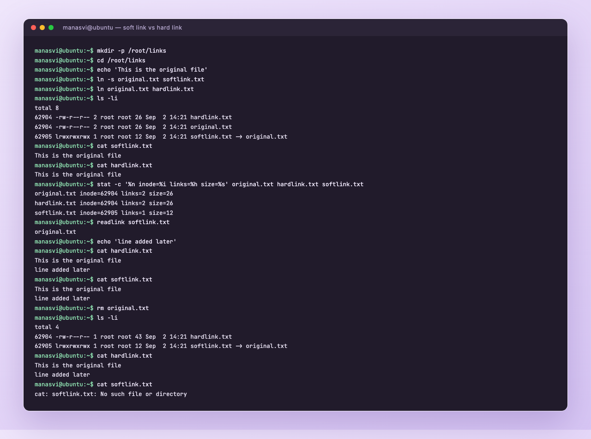
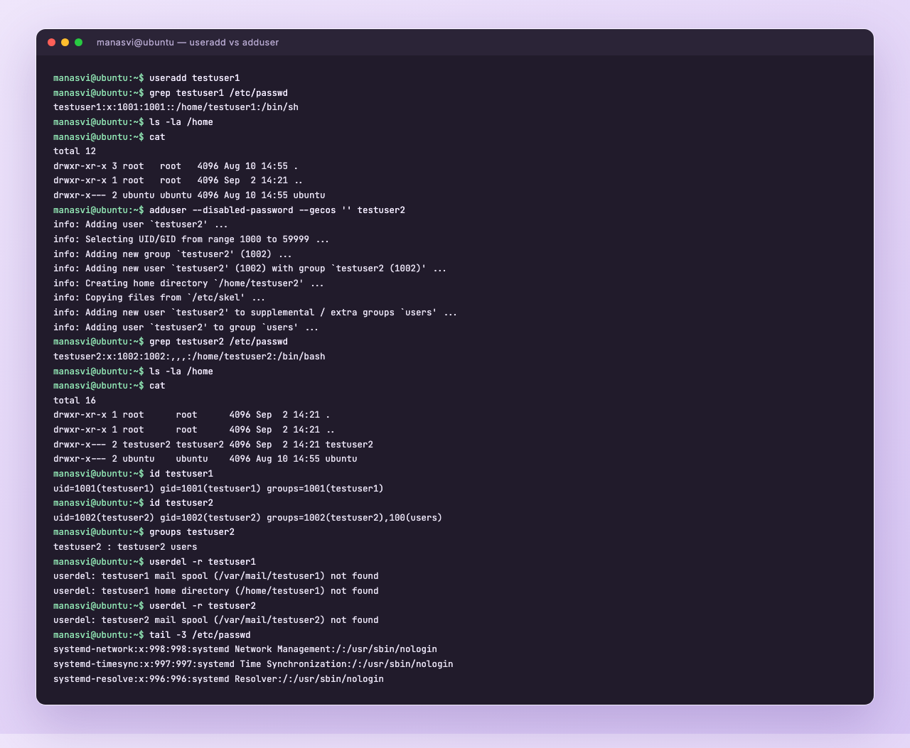
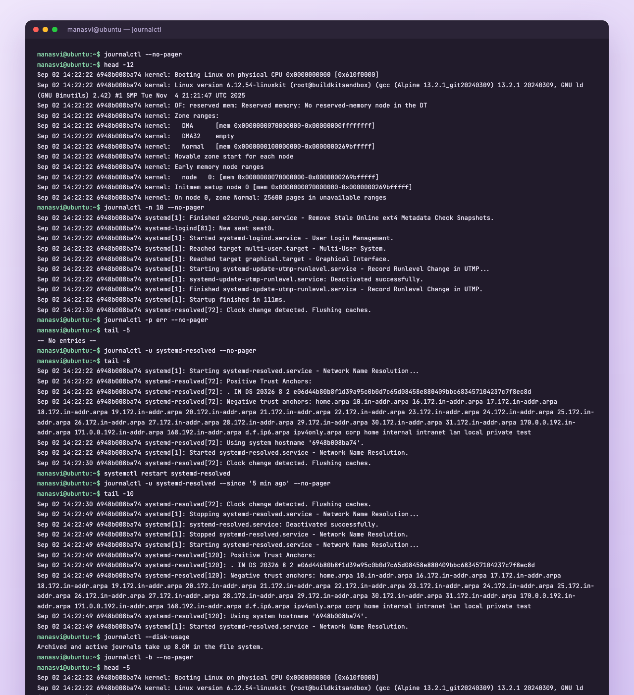
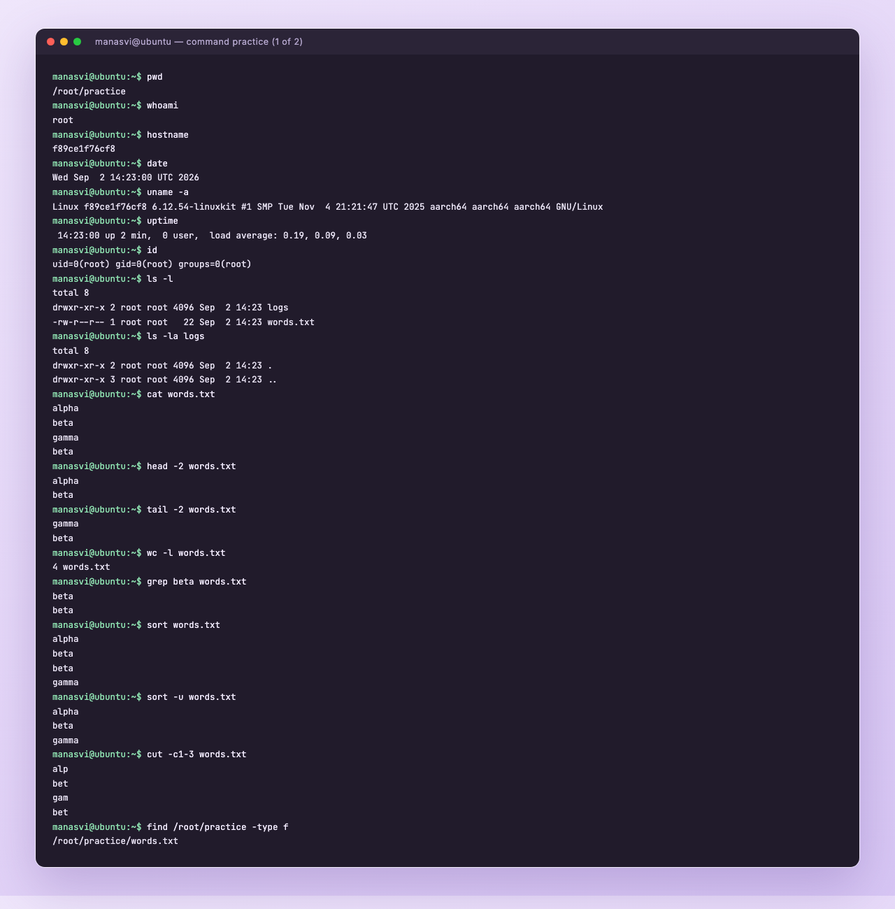
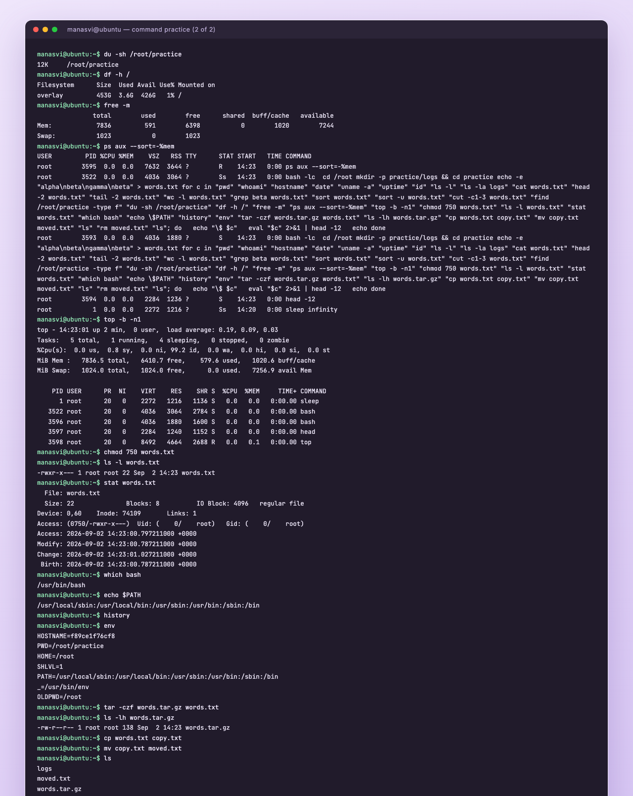

# Linux Fundamentals

Homework for the Linux session. I ran everything on an Ubuntu 24.04 box and copied the real
output here, along with screenshots of the terminal.

- [Task 1: Soft link vs hard link](#task-1-soft-link-vs-hard-link)
- [Task 2: adduser vs useradd](#task-2-adduser-vs-useradd)
- [Task 3: journalctl](#task-3-journalctl)
- [Task 4: Command cheat sheet practice](#task-4-command-cheat-sheet-practice)

---

## Task 1: Soft link vs hard link

### What is the actual difference

A hard link is a second name for the same inode. The file data on disk has one inode number, and
both names point straight at it. Neither name is the "real" one, they are equal. So if I delete the
original name, the data is still there because the inode still has a link count of 1.

A soft link (symbolic link) is its own small file with its own inode, and all it stores is the path
to another file. It is more like a shortcut. If the target goes away, the link stays but points at
nothing, and you get a broken link.

Quick way I remember it: hard link points to the **data**, soft link points to the **name**.

### Commands

```bash
ln original.txt hardlink.txt        # hard link
ln -s original.txt softlink.txt     # soft link
ls -li                              # -i shows inode numbers
readlink softlink.txt               # shows what a soft link points to
rm softlink.txt                     # deleting a link, not the target
unlink softlink.txt                 # same thing
```

### What I ran and what happened

```
$ echo "This is the original file" > original.txt
$ ln -s original.txt softlink.txt
$ ln original.txt hardlink.txt
$ ls -li
total 8
62904 -rw-r--r-- 2 root root 26 Sep  2 14:21 hardlink.txt
62904 -rw-r--r-- 2 root root 26 Sep  2 14:21 original.txt
62905 lrwxrwxrwx 1 root root 12 Sep  2 14:21 softlink.txt -> original.txt
```

Two things to notice here. `original.txt` and `hardlink.txt` share inode `62904` and both show a
link count of `2`. `softlink.txt` has a different inode (`62905`) and its size is 12 bytes, which is
just the length of the string `original.txt`.

```
$ stat -c "%n inode=%i links=%h size=%s" original.txt hardlink.txt softlink.txt
original.txt inode=62904 links=2 size=26
hardlink.txt inode=62904 links=2 size=26
softlink.txt inode=62905 links=1 size=12
```

Appending to the original shows up through both links, as expected:

```
$ echo "line added later" >> original.txt
$ cat hardlink.txt
This is the original file
line added later
$ cat softlink.txt
This is the original file
line added later
```

Now the interesting part, deleting the original:

```
$ rm original.txt
$ ls -li
total 4
62904 -rw-r--r-- 1 root root 43 Sep  2 14:21 hardlink.txt
62905 lrwxrwxrwx 1 root root 12 Sep  2 14:21 softlink.txt -> original.txt

$ cat hardlink.txt
This is the original file
line added later

$ cat softlink.txt
cat: softlink.txt: No such file or directory
```

The hard link still gives me the full content (link count dropped from 2 to 1), while the soft link
is now broken because the path it stored no longer exists.



### Interview version of the answer

| | Hard link | Soft link |
|---|---|---|
| Points to | the inode (data) | a path (name) |
| Own inode | no, shares it | yes |
| Survives deleting the target | yes | no, becomes broken |
| Works across filesystems | no | yes |
| Can link a directory | no (except `.` and `..`) | yes |
| Size | same as the file | length of the target path |
| Command | `ln file link` | `ln -s file link` |

One extra point that gets asked: you cannot hard link across two different partitions, because
inode numbers are only unique inside one filesystem. A soft link stores text, so it can point
anywhere, even at a path that does not exist yet.

---

## Task 2: adduser vs useradd

### The difference

`useradd` is the low level binary. It creates the account entry and nothing more unless you ask for
it with flags, so no home directory, no password, and the shell falls back to whatever the default
is (`/bin/sh` on Ubuntu).

`adduser` is a Perl script on Debian and Ubuntu that wraps `useradd`. It is interactive and it does
the polite things for you: creates the home directory, copies `/etc/skel` into it, sets the shell to
bash, creates a matching group, adds the supplemental groups, and prompts for a password.

### Which one is preferred on Ubuntu

`adduser`, because it follows the Debian policy defaults and you get a usable account in one step.
`useradd` is what you want in scripts and automation, where you pass every flag explicitly and do
not want an interactive prompt.

### What I ran

```
$ useradd testuser1
$ grep testuser1 /etc/passwd
testuser1:x:1001:1001::/home/testuser1:/bin/sh
$ ls -la /home
total 12
drwxr-xr-x 3 root   root   4096 Aug 10 14:55 .
drwxr-xr-x 1 root   root   4096 Sep  2 14:21 ..
drwxr-x--- 2 ubuntu ubuntu 4096 Aug 10 14:55 ubuntu
```

The passwd entry says the home should be `/home/testuser1`, but `/home` shows no such directory.
`useradd` recorded the path without creating it. Also note the shell is `/bin/sh`.

Now the recommended command:

```
$ adduser --disabled-password --gecos "" testuser2
info: Adding user `testuser2' ...
info: Selecting UID/GID from range 1000 to 59999 ...
info: Adding new group `testuser2' (1002) ...
info: Adding new user `testuser2' (1002) with group `testuser2 (1002)' ...
info: Creating home directory `/home/testuser2' ...
info: Copying files from `/etc/skel' ...
info: Adding new user `testuser2' to supplemental / extra groups `users' ...
info: Adding user `testuser2' to group `users' ...

$ grep testuser2 /etc/passwd
testuser2:x:1002:1002:,,,:/home/testuser2:/bin/bash

$ ls -la /home
total 16
drwxr-xr-x 1 root      root      4096 Sep  2 14:21 .
drwxr-xr-x 1 root      root      4096 Sep  2 14:21 ..
drwxr-x--- 2 testuser2 testuser2 4096 Sep  2 14:21 testuser2
drwxr-x--- 2 ubuntu    ubuntu    4096 Aug 10 14:55 ubuntu
```

Home directory created, skel files copied, shell is bash. Group membership also differs:

```
$ id testuser1
uid=1001(testuser1) gid=1001(testuser1) groups=1001(testuser1)
$ id testuser2
uid=1002(testuser2) gid=1002(testuser2) groups=1002(testuser2),100(users)
```

I used `--disabled-password` because I was running non interactively. Normally `adduser testuser2`
prompts for the password and the full name fields.

Cleanup:

```bash
userdel -r testuser1
userdel -r testuser2
```



To get the same result out of `useradd` you have to spell it all out:

```bash
useradd -m -s /bin/bash -G users testuser1
passwd testuser1
```

`-m` makes the home directory, `-s` sets the shell, `-G` adds extra groups.

---

## Task 3: journalctl

### What it is for

`journalctl` reads the systemd journal. Instead of hunting through separate files in `/var/log`,
systemd collects logs from the kernel, initrd, services and anything writing to stdout/stderr under
a unit, and stores them in one indexed binary journal. `journalctl` is the query tool for it, so you
can filter by unit, priority, boot, or time range.

### Commands I use most

```bash
journalctl                          # everything, oldest first
journalctl -n 20                    # last 20 lines
journalctl -f                       # follow, like tail -f
journalctl -u nginx                 # only one service
journalctl -u nginx --since "1 hour ago"
journalctl -p err                   # only error priority and worse
journalctl -b                       # current boot
journalctl -b -1                    # previous boot
journalctl --disk-usage             # how much space the journal is using
journalctl --vacuum-time=7d         # trim journal older than 7 days
journalctl --no-pager               # do not open less, useful in scripts
```

Priority levels for `-p`: `emerg 0, alert 1, crit 2, err 3, warning 4, notice 5, info 6, debug 7`.

### Output from my run

Last 10 lines of the journal:

```
$ journalctl -n 10 --no-pager
Sep 02 14:22:22 6948b008ba74 systemd[1]: Finished e2scrub_reap.service - Remove Stale Online ext4 Metadata Check Snapshots.
Sep 02 14:22:22 6948b008ba74 systemd-logind[81]: New seat seat0.
Sep 02 14:22:22 6948b008ba74 systemd[1]: Started systemd-logind.service - User Login Management.
Sep 02 14:22:22 6948b008ba74 systemd[1]: Reached target multi-user.target - Multi-User System.
Sep 02 14:22:22 6948b008ba74 systemd[1]: Reached target graphical.target - Graphical Interface.
Sep 02 14:22:22 6948b008ba74 systemd[1]: Starting systemd-update-utmp-runlevel.service - Record Runlevel Change in UTMP...
Sep 02 14:22:22 6948b008ba74 systemd[1]: systemd-update-utmp-runlevel.service: Deactivated successfully.
Sep 02 14:22:22 6948b008ba74 systemd[1]: Finished systemd-update-utmp-runlevel.service - Record Runlevel Change in UTMP.
Sep 02 14:22:22 6948b008ba74 systemd[1]: Startup finished in 111ms.
Sep 02 14:22:30 6948b008ba74 systemd-resolved[72]: Clock change detected. Flushing caches.
```

### Checking logs for one specific service

This was the part I wanted to practise properly, so I restarted a service and then read only that
unit's logs:

```
$ journalctl -u systemd-resolved --no-pager | tail -8
Sep 02 14:22:22 6948b008ba74 systemd[1]: Starting systemd-resolved.service - Network Name Resolution...
Sep 02 14:22:22 6948b008ba74 systemd-resolved[72]: Positive Trust Anchors:
Sep 02 14:22:22 6948b008ba74 systemd-resolved[72]: . IN DS 20326 8 2 e06d44b80b8f1d39a95c0b0d7c65d08458e880409bbc683457104237c7f8ec8d
Sep 02 14:22:22 6948b008ba74 systemd-resolved[72]: Using system hostname '6948b008ba74'.
Sep 02 14:22:22 6948b008ba74 systemd[1]: Started systemd-resolved.service - Network Name Resolution.
Sep 02 14:22:30 6948b008ba74 systemd-resolved[72]: Clock change detected. Flushing caches.

$ systemctl restart systemd-resolved

$ journalctl -u systemd-resolved --since "5 min ago" --no-pager | tail -10
Sep 02 14:22:49 6948b008ba74 systemd[1]: Stopping systemd-resolved.service - Network Name Resolution...
Sep 02 14:22:49 6948b008ba74 systemd[1]: systemd-resolved.service: Deactivated successfully.
Sep 02 14:22:49 6948b008ba74 systemd[1]: Stopped systemd-resolved.service - Network Name Resolution.
Sep 02 14:22:49 6948b008ba74 systemd[1]: Starting systemd-resolved.service - Network Name Resolution...
Sep 02 14:22:49 6948b008ba74 systemd-resolved[120]: Positive Trust Anchors:
Sep 02 14:22:49 6948b008ba74 systemd-resolved[120]: Using system hostname '6948b008ba74'.
Sep 02 14:22:49 6948b008ba74 systemd[1]: Started systemd-resolved.service - Network Name Resolution.
```

You can see the stop and start pair for exactly that unit, and the PID changing from 72 to 120,
which is a nice confirmation the restart actually happened.

Two more:

```
$ journalctl -p err --no-pager | tail -5
-- No entries --

$ journalctl --disk-usage
Archived and active journals take up 8.0M in the file system.
```

No error level entries, which is the answer you want to see when you are checking a healthy box.



---

## Task 4: Command cheat sheet practice

I went through the cheat sheet and ran the commands rather than only reading them. Output is in the
two screenshots below, and here is the summary of what each one is for.

### Files and directories

| Command | What it does |
|---|---|
| `pwd` | prints the directory I am in |
| `ls -l` / `ls -la` | list with details, `-a` includes dotfiles |
| `cd`, `cd ..`, `cd -` | change directory, go up, go back to previous |
| `mkdir -p a/b/c` | make directories, `-p` creates parents |
| `touch file` | create empty file or bump its timestamp |
| `cp src dst`, `cp -r dir dst` | copy, `-r` for directories |
| `mv old new` | move or rename |
| `rm file`, `rm -r dir` | delete, `-r` recursive |
| `find /path -type f -name "*.log"` | search the tree by type and name |
| `du -sh dir` | size of a directory |
| `df -h` | free space per filesystem |
| `tar -czf out.tar.gz dir` | compress, `-xzf` to extract |

### Reading files

| Command | What it does |
|---|---|
| `cat file` | dump the whole file |
| `head -n 5` / `tail -n 5` | first / last lines |
| `tail -f file` | follow a file as it grows, used constantly for logs |
| `less file` | page through a file |
| `wc -l file` | count lines |
| `grep pattern file` | search text, `-i` ignore case, `-r` recursive, `-n` line numbers |
| `sort` / `sort -u` | sort, and unique |
| `cut -d, -f2` | pick fields out of delimited text |

### Permissions and ownership

| Command | What it does |
|---|---|
| `chmod 750 file` | numeric permissions, r=4 w=2 x=1 |
| `chmod u+x file` | symbolic, add execute for the owner |
| `chown user:group file` | change owner and group |
| `chgrp group file` | change group only |
| `stat file` | full metadata including inode |
| `umask` | default permission mask for new files |

Numeric mode is just three digits, owner then group then others, each the sum of read 4, write 2,
execute 1. So `750` is `rwx` for owner, `r-x` for group, nothing for others.

### Processes and system

| Command | What it does |
|---|---|
| `ps aux` | snapshot of all processes |
| `ps aux --sort=-%mem` | sorted by memory, my usual way to find a hog |
| `top` / `htop` | live process view |
| `kill PID`, `kill -9 PID` | terminate, then force |
| `uptime` | how long the box has been up plus load average |
| `free -m` | memory in MB |
| `uname -a` | kernel and architecture |
| `whoami`, `id` | current user, and the uid/gid/groups |
| `systemctl status/start/stop/restart svc` | manage services |
| `which cmd` | where a binary lives |
| `env`, `echo $PATH` | environment variables |

### Sample of the output

```
$ pwd
/root/practice
$ uname -a
Linux f89ce1f76cf8 6.12.54-linuxkit #1 SMP Tue Nov  4 21:21:47 UTC 2025 aarch64 aarch64 aarch64 GNU/Linux
$ uptime
 14:23:00 up 2 min,  0 user,  load average: 0.19, 0.09, 0.03
$ grep beta words.txt
beta
beta
$ sort -u words.txt
alpha
beta
gamma
$ chmod 750 words.txt
$ ls -l words.txt
-rwxr-x--- 1 root root 22 Sep  2 14:23 words.txt
$ df -h /
Filesystem      Size  Used Avail Use% Mounted on
overlay         453G  3.6G  426G   1% /
```





### Filesystem layout, for revision

```
/          root of everything
/bin       essential binaries (ls, cp, cat)
/sbin      system binaries, mostly root only
/etc       configuration files
/home      user home directories
/var       variable data, /var/log lives here
/tmp       temporary files, sticky bit set, cleared on reboot
/usr       user programs and libraries
/opt       optional third party software
/proc      virtual filesystem for kernel and process info
/dev       device files
```

One thing I looked up while doing this: `/tmp` has permissions `1777`. The leading `1` is the sticky
bit, which means anyone can write there but you can only delete your own files. Without it, any user
could delete another user's temp files.
