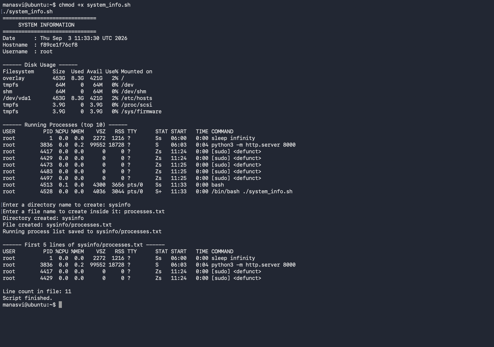

# Shell Scripting

Homework task: write one script that prints system information, uses variables, takes input with
`read -p`, creates a directory and a file, and saves the running processes into that file using `>`.

Script: [`system_info.sh`](system_info.sh)

## What the script covers

Every item the task asked for, and where it happens in the script:

| Requirement | How it is done |
|---|---|
| Current date | `CURRENT_DATE=$(date)` then echo |
| Hostname | `HOST_NAME=$(hostname)` |
| Username | `USER_NAME=$(whoami)` |
| Disk usage | `df -h` |
| Running processes | `ps aux \| head -10` |
| Variables | `CURRENT_DATE`, `HOST_NAME`, `USER_NAME`, `DIR_NAME`, `FILE_NAME` |
| User input | `read -p "Enter a directory name to create: " DIR_NAME` |
| `mkdir` | `mkdir -p "$DIR_NAME"` |
| `touch` | `touch "$DIR_NAME/$FILE_NAME"` |
| Output redirection | `ps aux > "$DIR_NAME/$FILE_NAME"` |

## The script

```bash
#!/bin/bash

CURRENT_DATE=$(date)
HOST_NAME=$(hostname)
USER_NAME=$(whoami)

echo "=============================="
echo "     SYSTEM INFORMATION"
echo "=============================="

echo "Date      : $CURRENT_DATE"
echo "Hostname  : $HOST_NAME"
echo "Username  : $USER_NAME"

echo
echo "------ Disk Usage ------"
df -h

echo
echo "------ Running Processes (top 10) ------"
ps aux | head -10

echo
read -p "Enter a directory name to create: " DIR_NAME
read -p "Enter a file name to create inside it: " FILE_NAME

mkdir -p "$DIR_NAME"
echo "Directory created: $DIR_NAME"

touch "$DIR_NAME/$FILE_NAME"
echo "File created: $DIR_NAME/$FILE_NAME"

ps aux > "$DIR_NAME/$FILE_NAME"
echo "Running process list saved to $DIR_NAME/$FILE_NAME"

echo
echo "------ First 5 lines of $DIR_NAME/$FILE_NAME ------"
head -5 "$DIR_NAME/$FILE_NAME"

echo
echo "Line count in file: $(wc -l < "$DIR_NAME/$FILE_NAME")"
echo "Script finished."
```

## How to run it

Two ways, and the difference matters:

```bash
chmod +x system_info.sh
./system_info.sh
```

or

```bash
bash system_info.sh
```

With `./system_info.sh` the file itself has to be executable, and the shebang line `#!/bin/bash`
decides which interpreter runs it. With `bash system_info.sh` I am handing the file to bash as an
argument, so the execute bit is not needed and the shebang is ignored.

## Output

I answered `sysinfo` for the directory and `processes.txt` for the file name.

```
$ chmod +x system_info.sh
$ ./system_info.sh
==============================
     SYSTEM INFORMATION
==============================
Date      : Thu Sep  3 11:33:30 UTC 2026
Hostname  : f89ce1f76cf8
Username  : root

------ Disk Usage ------
Filesystem      Size  Used Avail Use% Mounted on
overlay         453G  8.3G  421G   2% /
tmpfs            64M     0   64M   0% /dev
shm              64M     0   64M   0% /dev/shm
/dev/vda1       453G  8.3G  421G   2% /etc/hosts
tmpfs           3.9G     0  3.9G   0% /proc/scsi
tmpfs           3.9G     0  3.9G   0% /sys/firmware

------ Running Processes (top 10) ------
USER         PID %CPU %MEM    VSZ   RSS TTY      STAT START   TIME COMMAND
root           1  0.0  0.0   2272  1216 ?        Ss   06:00   0:00 sleep infinity
root        3836  0.0  0.2  99552 18728 ?        S    06:03   0:04 python3 -m http.server 8000
root        4417  0.0  0.0      0     0 ?        Zs   11:24   0:00 [sudo] <defunct>
root        4429  0.0  0.0      0     0 ?        Zs   11:24   0:00 [sudo] <defunct>
root        4473  0.0  0.0      0     0 ?        Zs   11:25   0:00 [sudo] <defunct>
root        4483  0.0  0.0      0     0 ?        Zs   11:25   0:00 [sudo] <defunct>
root        4497  0.0  0.0      0     0 ?        Zs   11:25   0:00 [sudo] <defunct>
root        4513  0.1  0.0   4300  3656 pts/0    Ss   11:33   0:00 bash
root        4528  0.0  0.0   4036  3044 pts/0    S+   11:33   0:00 /bin/bash ./system_info.sh

Enter a directory name to create: sysinfo
Enter a file name to create inside it: processes.txt
Directory created: sysinfo
File created: sysinfo/processes.txt
Running process list saved to sysinfo/processes.txt

------ First 5 lines of sysinfo/processes.txt ------
USER         PID %CPU %MEM    VSZ   RSS TTY      STAT START   TIME COMMAND
root           1  0.0  0.0   2272  1216 ?        Ss   06:00   0:00 sleep infinity
root        3836  0.0  0.2  99552 18728 ?        S    06:03   0:04 python3 -m http.server 8000
root        4417  0.0  0.0      0     0 ?        Zs   11:24   0:00 [sudo] <defunct>
root        4429  0.0  0.0      0     0 ?        Zs   11:24   0:00 [sudo] <defunct>

Line count in file: 11
Script finished.
```

Two things in that process list worth explaining, since they are visible in the screenshot:

`python3 -m http.server 8000` is the little web server I had left running from the networking task,
which is a good reminder that `ps aux` shows the true state of the machine, not just my script.

The `[sudo] <defunct>` entries with `Zs` state are zombie processes, left behind by the `sudo` calls
from the earlier user management task. A process becomes a zombie when it has exited but its parent
has not collected the exit status. Here the parent is PID 1, which is `sleep infinity` rather than a
real init system, and `sleep` never reaps children. On a normal machine systemd would clear these
immediately. They use no CPU or memory, which is why VSZ and RSS are both 0.



## Things I picked up while writing it

**No spaces around `=`.** `NAME="value"` works, `NAME = "value"` does not, because bash reads that
as running a command called `NAME`.

**Command substitution.** `$(date)` runs the command and gives back its output. Backticks do the
same but `$( )` nests properly, so I stick to it.

**Quote your variables.** I wrote `mkdir -p "$DIR_NAME"` with quotes on purpose. If someone types
`my folder` at the prompt, without quotes bash would treat it as two arguments and create two
directories.

**`>` vs `>>`.** `>` truncates the file and writes fresh, `>>` appends. The task asked for `>`,
which is why `processes.txt` holds only the process list from that one run.

**`mkdir -p` does not fail if the directory exists**, which makes the script safe to run twice.

**Why the line count is small.** `ps aux` inside a container only sees the processes in that
container's PID namespace, so the file has 11 lines. On a normal VM this would be a few hundred.
