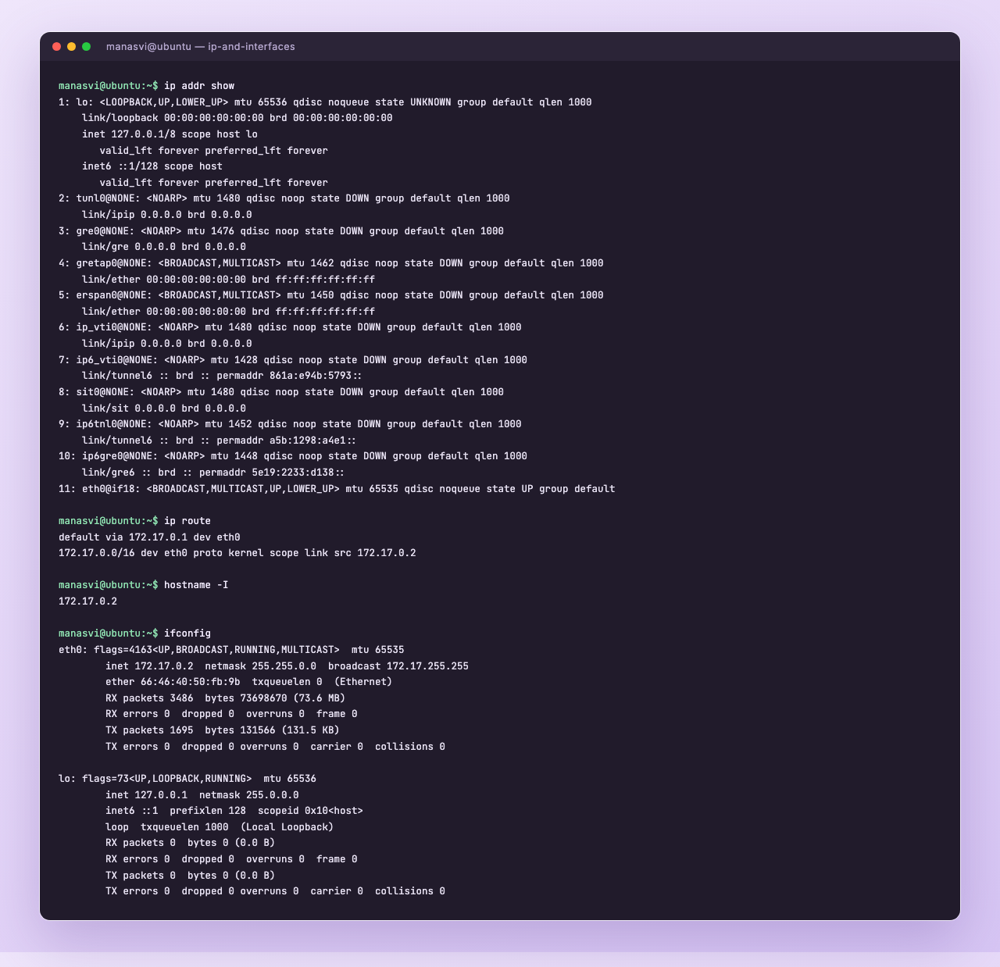
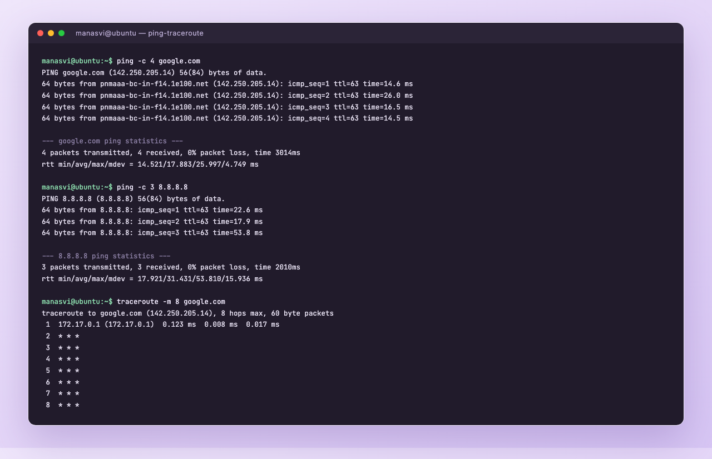
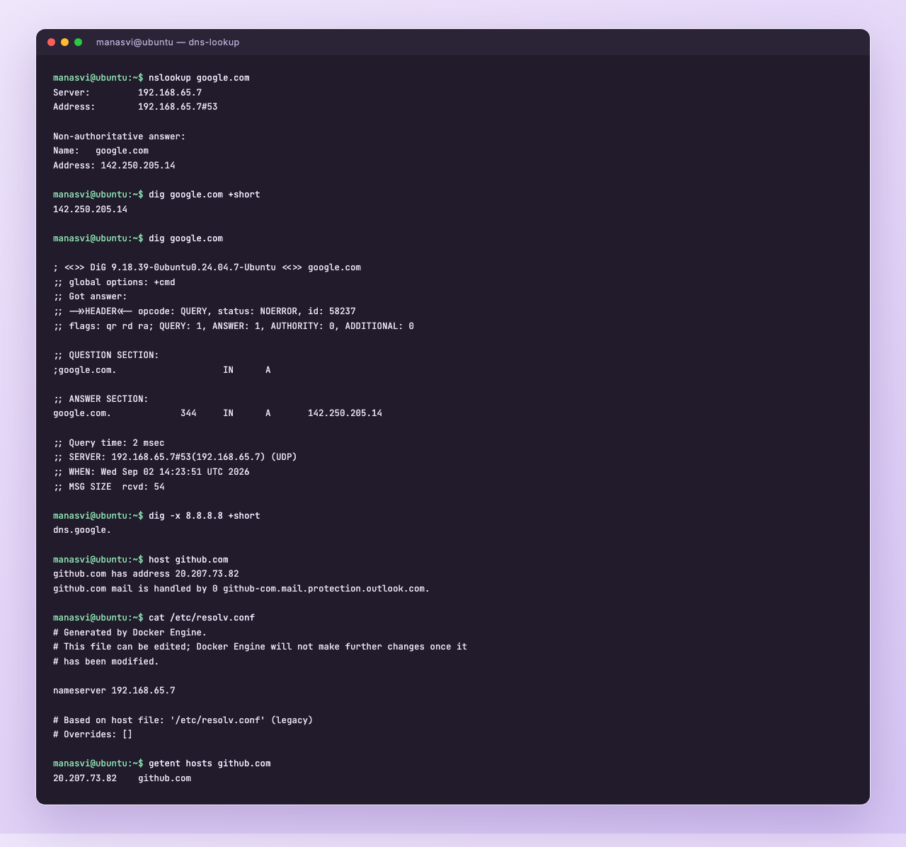
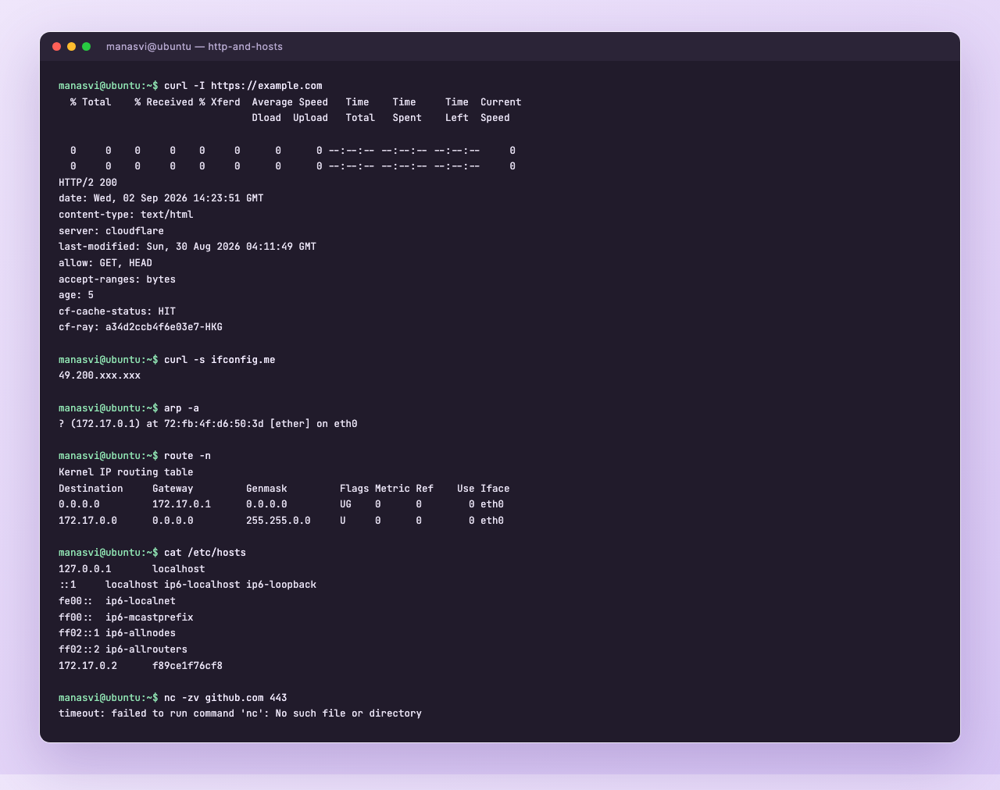
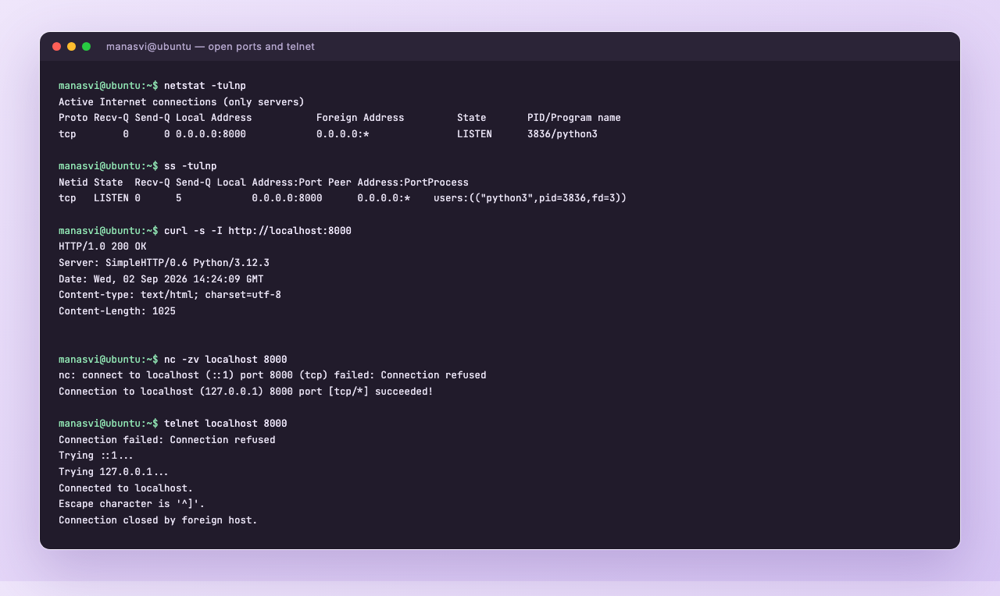

# Networking Fundamentals

Homework was to practise the networking commands from the devops-heros repo and then write up each
command with its output and what I understood from it. Reference repo:
[Nency-Ravaliya/devops-heros](https://github.com/Nency-Ravaliya/devops-heros/tree/main/session4-networking).

My public IP is masked as `49.200.xxx.xxx` in the output below.

- [Interfaces and addresses](#interfaces-and-addresses)
- [Reachability](#reachability-ping-and-traceroute)
- [DNS](#dns)
- [HTTP and local host file](#http-and-the-local-hosts-file)
- [Ports and connections](#ports-and-connections)
- [Theory notes](#theory-notes-from-the-session)

---

## Interfaces and addresses

### `ip addr show`

Lists every network interface and the addresses on it. This is the modern replacement for
`ifconfig`, from the `iproute2` package.

```
$ ip addr show
1: lo: <LOOPBACK,UP,LOWER_UP> mtu 65536 qdisc noqueue state UNKNOWN group default qlen 1000
    link/loopback 00:00:00:00:00:00 brd 00:00:00:00:00:00
    inet 127.0.0.1/8 scope host lo
       valid_lft forever preferred_lft forever
...
11: eth0@if18: <BROADCAST,MULTICAST,UP,LOWER_UP> mtu 65535 qdisc noqueue state UP group default
```

What I take from it: `lo` is the loopback with `127.0.0.1/8`, and `eth0` is the real interface which
is `UP`. The flags matter, `UP` means administratively enabled and `LOWER_UP` means the link
actually has carrier. If a box "has no network", checking those two flags first saves time.

### `ip route`

Shows the routing table, most importantly the default gateway.

```
$ ip route
default via 172.17.0.1 dev eth0
172.17.0.0/16 dev eth0 proto kernel scope link src 172.17.0.2
```

Two entries. Anything inside `172.17.0.0/16` is on the same link so it goes out directly, and
everything else is sent to `172.17.0.1`, the gateway. This is exactly the thing to check when you
can ping a local IP but nothing on the internet.

### `ifconfig`

Older tool, same information plus packet counters.

```
$ ifconfig
eth0: flags=4163<UP,BROADCAST,RUNNING,MULTICAST>  mtu 65535
        inet 172.17.0.2  netmask 255.255.0.0  broadcast 172.17.255.255
        ether 66:46:40:50:fb:9b  txqueuelen 0  (Ethernet)
        RX packets 3486  bytes 73698670 (73.6 MB)
        RX errors 0  dropped 0  overruns 0  frame 0
        TX packets 1695  bytes 131566 (131.5 KB)
```

Useful bit here is `RX/TX errors` and `dropped`. Non zero values point at a physical or driver
problem rather than a configuration one. On Windows the equivalent is `ipconfig /all`.

### `hostname -I`

Quick way to just get the IP without reading a full dump.

```
$ hostname -I
172.17.0.2
```



---

## Reachability, ping and traceroute

### `ping`

Sends ICMP echo requests and waits for echo replies. It answers two things: is the host reachable,
and how long does the round trip take.

```
$ ping -c 4 google.com
PING google.com (142.250.205.14) 56(84) bytes of data.
64 bytes from pnmaaa-bc-in-f14.1e100.net (142.250.205.14): icmp_seq=1 ttl=63 time=14.6 ms
64 bytes from pnmaaa-bc-in-f14.1e100.net (142.250.205.14): icmp_seq=2 ttl=63 time=26.0 ms
64 bytes from pnmaaa-bc-in-f14.1e100.net (142.250.205.14): icmp_seq=3 ttl=63 time=16.5 ms
64 bytes from pnmaaa-bc-in-f14.1e100.net (142.250.205.14): icmp_seq=4 ttl=63 time=14.5 ms

--- google.com ping statistics ---
4 packets transmitted, 4 received, 0% packet loss, time 3014ms
rtt min/avg/max/mdev = 14.521/17.883/25.997/4.749 ms
```

`0% packet loss` is the healthy answer. `ttl=63` tells me the packet passed one hop, since the reply
started at 64 and each router decrements it by one.

I also pinged an IP directly:

```
$ ping -c 3 8.8.8.8
64 bytes from 8.8.8.8: icmp_seq=1 ttl=63 time=22.6 ms
...
3 packets transmitted, 3 received, 0% packet loss, time 2010ms
```

This pair is the standard troubleshooting trick. If `ping 8.8.8.8` works but `ping google.com`
fails, the network is fine and DNS is broken.

### `traceroute`

Shows the path to a destination hop by hop, by sending packets with a TTL of 1, then 2, then 3, and
recording which router sends back the "time exceeded" message each time.

```
$ traceroute -m 8 google.com
traceroute to google.com (142.250.205.14), 8 hops max, 60 byte packets
 1  172.17.0.1 (172.17.0.1)  0.123 ms  0.008 ms  0.017 ms
 2  * * *
 3  * * *
```

Hop 1 is my gateway. After that everything is `* * *`, which does not mean the connection is broken,
it means those routers are not replying to the probes. Ping to the same host worked fine, so the
path is up and the intermediate devices are just filtering. Good reminder that stars in traceroute
are not automatically a fault.



---

## DNS

### `nslookup`

Resolves a name to an IP and shows which server answered.

```
$ nslookup google.com
Server:		192.168.65.7
Address:	192.168.65.7#53

Non-authoritative answer:
Name:	google.com
Address: 142.250.205.14
```

"Non authoritative" means this came from a resolver's cache, not from Google's own nameservers.
Port 53 is DNS.

### `dig`

More detailed than nslookup and the one I would use for real debugging.

```
$ dig google.com

; <<>> DiG 9.18.39 <<>> google.com
;; ->>HEADER<<- opcode: QUERY, status: NOERROR, id: 58237
;; flags: qr rd ra; QUERY: 1, ANSWER: 1, AUTHORITY: 0, ADDITIONAL: 0

;; QUESTION SECTION:
;google.com.			IN	A

;; ANSWER SECTION:
google.com.		344	IN	A	142.250.205.14

;; Query time: 2 msec
;; SERVER: 192.168.65.7#53(192.168.65.7) (UDP)
```

Reading it: `status: NOERROR` means the lookup was fine (`NXDOMAIN` would mean the name does not
exist). `344` is the TTL in seconds, so the record can be cached that long. `A` is the record type,
name to IPv4. `Query time: 2 msec` was fast because it was already cached.

Short form when I only want the address:

```
$ dig google.com +short
142.250.205.14
```

Reverse lookup, IP back to name, using the PTR record:

```
$ dig -x 8.8.8.8 +short
dns.google.
```

### `host`

Simplest of the three, and it also shows the mail records.

```
$ host github.com
github.com has address 20.207.73.82
github.com mail is handled by 0 github-com.mail.protection.outlook.com.
```

### `cat /etc/resolv.conf`

Where the system reads its DNS servers from. If this file is wrong, every name lookup fails no
matter how healthy the network is.

```
$ cat /etc/resolv.conf
nameserver 192.168.65.7
```



---

## HTTP and the local hosts file

### `curl -I`

Fetches only the response headers, so I can check whether a site is up and what it is served by
without downloading the page.

```
$ curl -I https://example.com
HTTP/2 200
date: Wed, 02 Sep 2026 14:23:51 GMT
content-type: text/html
server: cloudflare
last-modified: Sun, 30 Aug 2026 04:11:49 GMT
cf-cache-status: HIT
cf-ray: a34d2ccb4f6e03e7-HKG
```

`HTTP/2 200` is the status, `server: cloudflare` says it is behind a CDN, and `cf-cache-status: HIT`
means the CDN served it from cache instead of going back to the origin.

### Finding my public IP

```
$ curl -s ifconfig.me
49.200.xxx.xxx
```

This is different from the `172.17.0.2` on my interface, which is the whole point of NAT. Private
addresses inside, one public address facing the internet.

### `/etc/hosts`

Local static name to IP mapping. It is checked before DNS, so it is the fastest way to override a
name on one machine.

```
$ cat /etc/hosts
127.0.0.1	localhost
::1	localhost ip6-localhost ip6-loopback
172.17.0.2	f89ce1f76cf8
```

### `route -n` and `arp -a`

```
$ route -n
Kernel IP routing table
Destination     Gateway         Genmask         Flags Metric Ref    Use Iface
0.0.0.0         172.17.0.1      0.0.0.0         UG    0      0        0 eth0
172.17.0.0      0.0.0.0         255.255.0.0     U     0      0        0 eth0

$ arp -a
? (172.17.0.1) at 72:fb:4f:d6:50:3d [ether] on eth0
```

`route -n` is the same routing table in the older format, `-n` skips reverse DNS so it prints
numbers. `arp -a` shows the IP to MAC mappings the machine has learned, which is layer 3 to layer 2.
Everything on the local link has to be resolved to a MAC address before a frame can be sent.



---

## Ports and connections

To make this meaningful I started a listener on port 8000 first, otherwise the output is empty.

```
$ python3 -m http.server 8000 &

$ netstat -tulnp
Active Internet connections (only servers)
Proto Recv-Q Send-Q Local Address           Foreign Address         State       PID/Program name
tcp        0      0 0.0.0.0:8000            0.0.0.0:*               LISTEN      3836/python3

$ ss -tulnp
Netid State  Recv-Q Send-Q Local Address:Port Peer Address:Port Process
tcp   LISTEN 0      5            0.0.0.0:8000      0.0.0.0:*    users:(("python3",pid=3836,fd=3))
```

The flags I always use: `-t` tcp, `-u` udp, `-l` listening only, `-n` numeric, `-p` show the
process. `0.0.0.0:8000` means it listens on every interface. If it said `127.0.0.1:8000` it would
only accept connections from the machine itself, which is a very common reason a service looks dead
from outside.

`ss` is the newer, faster version of `netstat` and gives the same picture.

### `nc -zv` and `telnet`

Both answer the question "is this port actually open".

```
$ nc -zv localhost 8000
nc: connect to localhost (::1) port 8000 (tcp) failed: Connection refused
Connection to localhost (127.0.0.1) 8000 port [tcp/*] succeeded!

$ telnet localhost 8000
Trying ::1...
Trying 127.0.0.1...
Connected to localhost.
Escape character is '^]'.
```

The IPv6 attempt fails and the IPv4 one succeeds, because my server was bound to `0.0.0.0` which is
IPv4 only. Telnet's default port is 23, but giving it a port number turns it into a plain TCP
connectivity test, which is what it is mostly used for now. Exit with `Ctrl+]` then `quit`.

```
$ curl -s -I http://localhost:8000
HTTP/1.0 200 OK
Server: SimpleHTTP/0.6 Python/3.12.3
```



---

## Theory notes from the session

### IP addressing

An IP address identifies a device on a network. IPv4 is 32 bits written as four octets, so the range
is `0.0.0.0` to `255.255.255.255`. IPv6 is 128 bits and exists because IPv4 ran out.

Classes by first octet:

| Class | Range | Default mask | Network bits |
|---|---|---|---|
| A | 1 – 127 | 255.0.0.0 | 8 |
| B | 128 – 191 | 255.255.0.0 | 16 |
| C | 192 – 223 | 255.255.255.0 | 24 |
| D | 224 – 239 | multicast | — |

Private ranges, which never appear on the public internet:

```
10.0.0.0    – 10.255.255.255     (10.0.0.0/8)
172.16.0.0  – 172.31.255.255     (172.16.0.0/12)
192.168.0.0 – 192.168.255.255    (192.168.0.0/16)
```

My container's `172.17.0.2` sits in the second one, which is what Docker uses by default.

### Subnet mask and CIDR

The mask splits the address into a network part and a host part. CIDR writes it as a suffix, so
`/24` means the first 24 bits are network.

Worked example from the notes, `197.23.45.10` with mask `255.255.255.0`:

```
network bits = 24, host bits = 8
total addresses    = 2^8 = 256
usable hosts       = 256 - 2 = 254
network address    = 197.23.45.0
broadcast address  = 197.23.45.255
```

The minus two is because the all zeros address is the network itself and the all ones address is the
broadcast, so neither can be given to a host.

For a class A `/8` such as `120.27.1.0/8`: 24 host bits, `2^24` addresses, `2^24 - 2` usable.

### DHCP

Instead of setting addresses by hand, a DHCP server hands them out. The exchange is DORA: the client
**Discovers**, the server **Offers** an address, the client **Requests** it, the server
**Acknowledges**. The lease expires and gets renewed, which is why an IP can change after a reboot.

### NAT

Network Address Translation maps many private addresses onto one public address. The router keeps a
table of which internal IP and port a connection belongs to, so replies find their way back. This is
why `ifconfig` shows `172.17.0.2` while `curl ifconfig.me` shows something completely different.

### DNS

Translates names to IPs so people do not have to remember addresses. Lookup order on a Linux box is
`/etc/hosts` first, then the nameservers in `/etc/resolv.conf`, then up the chain: recursive
resolver, root servers, TLD servers, authoritative nameserver. Common record types: `A` (IPv4),
`AAAA` (IPv6), `CNAME` (alias), `MX` (mail), `NS` (nameservers), `PTR` (reverse), `TXT`.

### OSI model

| Layer | Name | Example |
|---|---|---|
| 7 | Application | HTTP, DNS, SSH |
| 6 | Presentation | TLS, encoding |
| 5 | Session | session setup and teardown |
| 4 | Transport | TCP, UDP |
| 3 | Network | IP, ICMP, routers |
| 2 | Data link | Ethernet, MAC, switches |
| 1 | Physical | cables, radio |

Mapping it to the commands above: `ping` is layer 3 (ICMP), `telnet` and `ss` are layer 4 (TCP),
`arp` sits between 3 and 2, and `curl` is layer 7.

### TCP vs UDP

| | TCP | UDP |
|---|---|---|
| Connection | three way handshake first | none, just send |
| Delivery | guaranteed, retransmits | best effort |
| Ordering | in order | can arrive out of order |
| Speed | slower, more overhead | faster, tiny header |
| Used by | HTTP, SSH, SQL | DNS queries, video, VoIP |

### HTTP, HTTPS and TLS

HTTP is plain text on port 80, so anything in between can read it. HTTPS is the same protocol inside
a TLS tunnel on port 443. The server presents a certificate signed by a CA, the client verifies it,
they agree on session keys, and the traffic after that is encrypted. This is why the `curl -I` output
above came back as `HTTP/2` over `https` without any warning, the certificate checked out.

### Ports worth remembering

```
20/21 FTP    22 SSH    23 Telnet    25 SMTP    53 DNS
80 HTTP      110 POP3  143 IMAP     443 HTTPS  3306 MySQL
3389 RDP     5432 PostgreSQL        6379 Redis 27017 MongoDB
```

### Basic security practices from the session

Use HTTPS instead of HTTP, keep firewall rules tight and only open the ports a service actually
needs, use a VPN for remote access to private networks, and use SSH keys rather than passwords.
