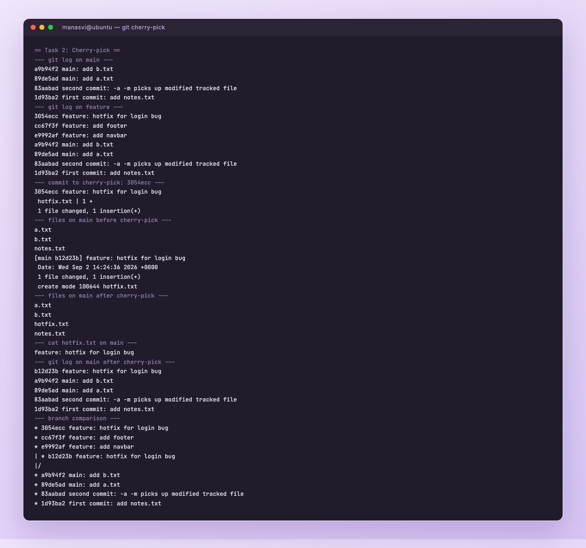

# Git / GitHub

Two tasks: understand `git commit -a -m` against `git commit -m`, and do a cherry-pick end to end.
Both were run in a throwaway repo and the real output is below.

- [Task 1: git commit -a -m vs git commit -m](#task-1-git-commit-a-m-vs-git-commit-m)
- [Task 2: cherry-pick](#task-2-cherry-pick)

---

## Task 1: git commit -a -m vs git commit -m

### The difference

`git commit -m "msg"` commits **only what is already staged**. If I modified a file but never ran
`git add`, there is nothing in the staging area and the commit fails.

`git commit -a -m "msg"` means "stage all modified and deleted **tracked** files first, then
commit". It is `git add -u` plus `git commit` in one step.

The catch, and this is the part that gets asked: `-a` does **not** pick up untracked files. A brand
new file git has never seen still needs an explicit `git add`.

### Setup

```bash
mkdir git-demo && cd git-demo
git init -b main
git config user.name "Manasvi"
git config user.email "manasvi@example.com"

echo "line 1" > notes.txt
git add notes.txt
git commit -m "first commit: add notes.txt"
```

Then I modified the tracked file and created a new untracked one, so both cases are covered in one
test:

```bash
echo "line 2 (modified tracked file)" >> notes.txt
echo "untracked content" > extra.txt
```

### What happened

```
$ git status --short
 M notes.txt
?? extra.txt
```

`M` is a modified tracked file, `??` is untracked.

Trying to commit with `-m` only, without staging anything:

```
$ git commit -m "attempt with -m only"
On branch main
Changes not staged for commit:
  (use "git add <file>..." to update what will be committed)
  (use "git restore <file>..." to discard changes in working directory)
	modified:   notes.txt

Untracked files:
  (use "git add <file>..." to include in what will be committed)
	extra.txt

no changes added to commit (use "git add" and/or "git commit -a")
exit code: 1
```

It refused, exit code 1, no commit created. Git even suggests the fix in the last line.

Now the same situation with `-a -m`:

```
$ git commit -a -m "second commit: -a -m picks up modified tracked file"
[main 83aabad] second commit: -a -m picks up modified tracked file
 1 file changed, 1 insertion(+)
exit code: 0
```

It worked, and note it says **1 file changed**, not 2:

```
$ git status --short
?? extra.txt

$ git log --oneline
83aabad second commit: -a -m picks up modified tracked file
1d93ba2 first commit: add notes.txt
```

`notes.txt` got committed, `extra.txt` is still sitting there untracked. That is the whole lesson in
one screen.


### Summary

| | `git commit -m` | `git commit -a -m` |
|---|---|---|
| Modified tracked files | only if staged | staged automatically |
| Deleted tracked files | only if staged | staged automatically |
| New untracked files | needs `git add` | still needs `git add` |
| Fails on nothing staged | yes | no, if tracked files changed |

When I want to be careful about what goes into a commit I use `git add -p` and `git commit -m`.
`-a -m` is the quick path when I know every change in the working tree belongs together.

---

## Task 2: cherry-pick

### What it does

`git cherry-pick <commit>` takes the diff introduced by one commit and applies it on top of the
branch I am currently on, as a new commit. It copies the change, not the commit, so the new commit
gets a different hash. Useful when one fix on a feature branch is needed on main right away and the
rest of the branch is not ready to merge.

### Steps

Commits on main first:

```bash
echo "main change A" > a.txt && git add . && git commit -m "main: add a.txt"
echo "main change B" > b.txt && git add . && git commit -m "main: add b.txt"
git log --oneline
```

```
$ git log --oneline
a9b94f2 main: add b.txt
89de5ad main: add a.txt
83aabad second commit: -a -m picks up modified tracked file
1d93ba2 first commit: add notes.txt
```

New branch with three commits:

```bash
git checkout -b feature
echo "feature: navbar" > navbar.txt   && git add . && git commit -m "feature: add navbar"
echo "feature: footer" > footer.txt   && git add . && git commit -m "feature: add footer"
echo "feature: hotfix for login bug" > hotfix.txt && git add . && git commit -m "feature: hotfix for login bug"
```

```
$ git log --oneline
3054ecc feature: hotfix for login bug
cc67f3f feature: add footer
e9992af feature: add navbar
a9b94f2 main: add b.txt
89de5ad main: add a.txt
```

The commit I want on main is the hotfix, `3054ecc`. Only that one, not the navbar or footer work:

```
$ git show --stat --oneline 3054ecc
3054ecc feature: hotfix for login bug
 hotfix.txt | 1 +
 1 file changed, 1 insertion(+)
```

Back to main and cherry-pick it:

```
$ git checkout main
$ ls
a.txt
b.txt
notes.txt

$ git cherry-pick 3054ecc
[main b12d23b] feature: hotfix for login bug
 Date: Wed Sep 2 14:24:36 2026 +0000
 1 file changed, 1 insertion(+)
 create mode 100644 hotfix.txt
```

### Verifying the change is on main

```
$ ls
a.txt
b.txt
hotfix.txt
notes.txt

$ cat hotfix.txt
feature: hotfix for login bug

$ git log --oneline
b12d23b feature: hotfix for login bug
a9b94f2 main: add b.txt
89de5ad main: add a.txt
83aabad second commit: -a -m picks up modified tracked file
1d93ba2 first commit: add notes.txt
```

`hotfix.txt` is on main now, and `navbar.txt` and `footer.txt` are not, which is exactly what I
wanted. The branch graph makes it clearest:

```
$ git log --oneline --graph --all
* 3054ecc feature: hotfix for login bug
* cc67f3f feature: add footer
* e9992af feature: add navbar
| * b12d23b feature: hotfix for login bug
|/
* a9b94f2 main: add b.txt
* 89de5ad main: add a.txt
* 83aabad second commit: -a -m picks up modified tracked file
* 1d93ba2 first commit: add notes.txt
```

The important detail: on feature the commit is `3054ecc`, on main the same change is `b12d23b`. Same
message, same diff, different hash, because a commit hash includes its parent and its timestamp. So
cherry-pick genuinely creates a new commit rather than moving the old one.



### Extra notes

If the same lines were already changed on main, cherry-pick stops with a conflict. Then it is:

```bash
git status                 # see the conflicted files
# fix the markers in the file
git add <file>
git cherry-pick --continue
```

or `git cherry-pick --abort` to walk away.

Other flags worth knowing:

```bash
git cherry-pick A B C           # several commits
git cherry-pick A..C            # a range, excluding A
git cherry-pick -n <commit>     # apply to working tree without committing
git cherry-pick -x <commit>     # adds "(cherry picked from ...)" to the message
```

### Cherry-pick against merge and rebase

`merge` brings in every commit of a branch and records a merge commit. `rebase` replays my commits
on top of another branch to keep history linear. `cherry-pick` takes one or a few specific commits
and leaves the rest behind. Cherry-pick is the surgical one, and because it duplicates commits it is
worth avoiding as a routine habit, otherwise the history ends up with the same change twice.
