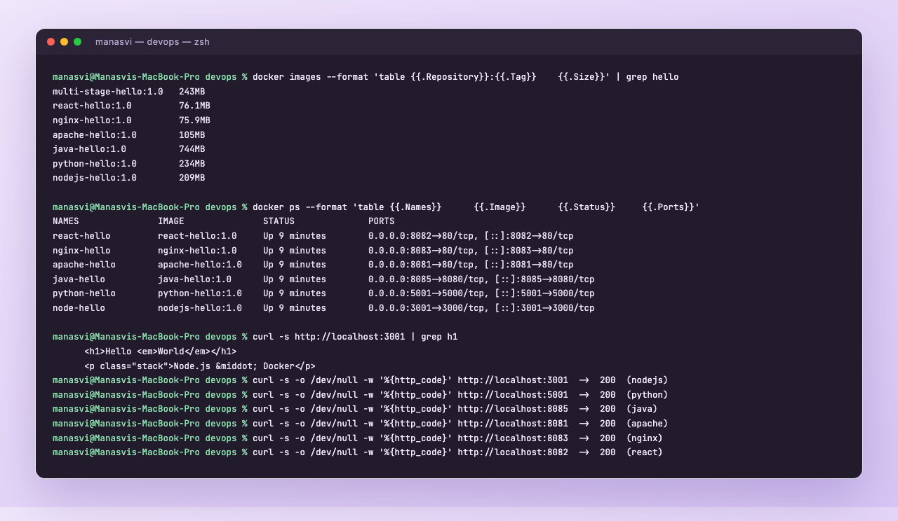
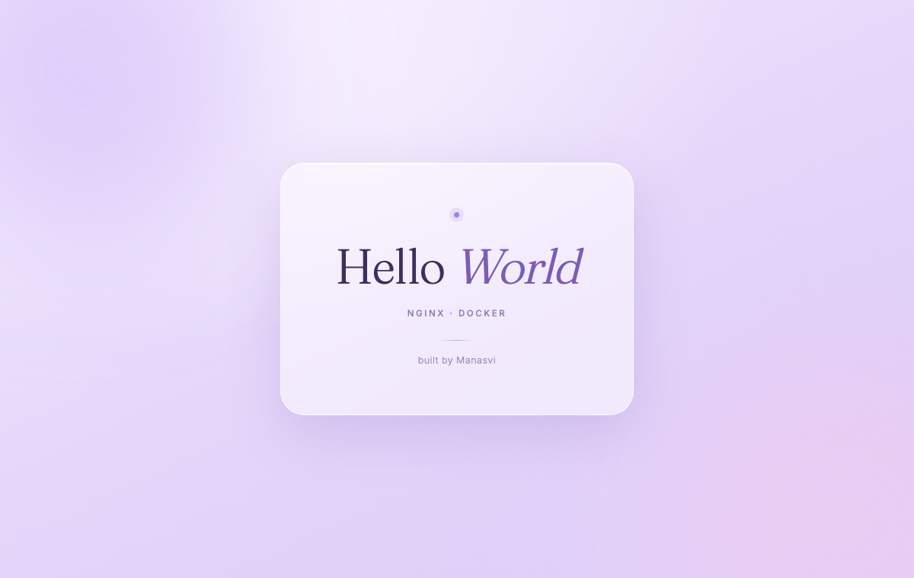

# Docker Hello World Applications

Task was to build a Hello World web app for six different stacks, each in its own folder with its
own Dockerfile, then build the image, run the container and confirm the page loads in a browser.

All six use the same page design so it is easy to see which stack served it, and each one names its
stack under the heading.

## Folder structure

```
05-docker-hello-world/
├── nodejs-app/     Express server on port 3000
├── python-app/     Flask server on port 5000
├── java-app/       Java HttpServer on port 8080
├── apache-app/     httpd:2.4-alpine serving static html
├── react-app/      Vite + React build served by nginx (multi-stage)
├── nginx-app/      nginx:1.27-alpine serving static html
├── _shared/        the html template the six pages are generated from
└── screenshots/
```

## Ports I mapped

| App | Image | Container port | Host port |
|---|---|---|---|
| nodejs-app | `nodejs-hello:1.0` | 3000 | 3001 |
| python-app | `python-hello:1.0` | 5000 | 5001 |
| java-app | `java-hello:1.0` | 8080 | 8085 |
| apache-app | `apache-hello:1.0` | 80 | 8081 |
| react-app | `react-hello:1.0` | 80 | 8082 |
| nginx-app | `nginx-hello:1.0` | 80 | 8083 |

I kept 8080 free on the host because the multi-stage homework needs it.

## Build and run

```bash
docker build -t nodejs-hello:1.0 ./nodejs-app
docker build -t python-hello:1.0 ./python-app
docker build -t java-hello:1.0   ./java-app
docker build -t apache-hello:1.0 ./apache-app
docker build -t nginx-hello:1.0  ./nginx-app
docker build -t react-hello:1.0  ./react-app

docker run -d --name node-hello   -p 3001:3000 nodejs-hello:1.0
docker run -d --name python-hello -p 5001:5000 python-hello:1.0
docker run -d --name java-hello   -p 8085:8080 java-hello:1.0
docker run -d --name apache-hello -p 8081:80   apache-hello:1.0
docker run -d --name react-hello  -p 8082:80   react-hello:1.0
docker run -d --name nginx-hello  -p 8083:80   nginx-hello:1.0
```

## All six running

```
$ docker ps --format "table {{.Names}}\t{{.Image}}\t{{.Status}}\t{{.Ports}}"
NAMES          IMAGE              STATUS         PORTS
react-hello    react-hello:1.0    Up 6 seconds   0.0.0.0:8082->80/tcp, [::]:8082->80/tcp
nginx-hello    nginx-hello:1.0    Up 6 seconds   0.0.0.0:8083->80/tcp, [::]:8083->80/tcp
apache-hello   apache-hello:1.0   Up 6 seconds   0.0.0.0:8081->80/tcp, [::]:8081->80/tcp
java-hello     java-hello:1.0     Up 6 seconds   0.0.0.0:8085->8080/tcp, [::]:8085->8080/tcp
python-hello   python-hello:1.0   Up 6 seconds   0.0.0.0:5001->5000/tcp, [::]:5001->5000/tcp
node-hello     nodejs-hello:1.0   Up 6 seconds   0.0.0.0:3001->3000/tcp, [::]:3001->3000/tcp
```

Every one answered with 200:

```
$ curl -s -o /dev/null -w '%{http_code}' http://localhost:3001  ->  200  (nodejs)
$ curl -s -o /dev/null -w '%{http_code}' http://localhost:5001  ->  200  (python)
$ curl -s -o /dev/null -w '%{http_code}' http://localhost:8085  ->  200  (java)
$ curl -s -o /dev/null -w '%{http_code}' http://localhost:8081  ->  200  (apache)
$ curl -s -o /dev/null -w '%{http_code}' http://localhost:8083  ->  200  (nginx)
$ curl -s -o /dev/null -w '%{http_code}' http://localhost:8082  ->  200  (react)
```



---

## 1. Node.js app

`nodejs-app/Dockerfile`

```dockerfile
FROM node:20-alpine

WORKDIR /app

COPY package*.json ./
RUN npm install --omit=dev

COPY server.js index.html ./

EXPOSE 3000
CMD ["npm", "start"]
```

I copy `package*.json` and install before copying the source on purpose. Docker caches each layer,
so as long as the dependencies have not changed, editing `server.js` reuses the cached
`npm install` layer instead of reinstalling everything.


## 2. Python app

`python-app/Dockerfile`

```dockerfile
FROM python:3.12-slim

WORKDIR /app

COPY requirements.txt ./
RUN pip install --no-cache-dir -r requirements.txt

COPY app.py index.html ./

EXPOSE 5000
CMD ["python", "app.py"]
```

Flask has to bind to `0.0.0.0` and not `127.0.0.1`, otherwise it only listens inside the container
and the port mapping gives a connection refused. `--no-cache-dir` keeps pip's cache out of the
image.


## 3. Java app

`java-app/Dockerfile`

```dockerfile
FROM eclipse-temurin:21-jdk

WORKDIR /app

COPY HelloWorld.java index.html ./
RUN javac HelloWorld.java

EXPOSE 8080
CMD ["java", "HelloWorld"]
```

The app uses the `com.sun.net.httpserver.HttpServer` that ships with the JDK, so there is no Maven
or Gradle in the way. `javac` runs at build time so the compiled class is baked into the image and
the container only has to run it.


## 4. Apache app

`apache-app/Dockerfile`

```dockerfile
FROM httpd:2.4-alpine

COPY index.html /usr/local/apache2/htdocs/index.html

EXPOSE 80
```

No `CMD` needed, the base image already starts `httpd -D FOREGROUND`. The only thing to know is
Apache's document root inside this image, which is `/usr/local/apache2/htdocs`.


## 5. React app

`react-app/Dockerfile`

```dockerfile
FROM node:20-alpine AS builder

WORKDIR /app

COPY package*.json ./
RUN npm install

COPY . .
RUN npm run build

FROM nginx:1.27-alpine AS production

COPY --from=builder /app/dist /usr/share/nginx/html
COPY nginx.conf /etc/nginx/conf.d/default.conf

EXPOSE 80
```

This one is a multi-stage build because React is compiled, not interpreted. The first stage has
node and all the dev dependencies and produces `dist/`. The second stage is just nginx with those
static files copied in, so node and `node_modules` never reach the final image.

The nginx config has `try_files $uri $uri/ /index.html;` so any route falls back to `index.html`,
which is what a single page app needs.


## 6. Nginx app

`nginx-app/Dockerfile`

```dockerfile
FROM nginx:1.27-alpine

COPY index.html /usr/share/nginx/html/index.html

EXPOSE 80
```

Smallest of the six. Nginx's default root here is `/usr/share/nginx/html`, note it is a different
path from Apache's.



---

## What I took away from this task

**`EXPOSE` does not publish anything.** It is documentation inside the image. The mapping only
happens with `-p host:container` at run time. I mixed this up at first and could not reach the app.

**Container port stays the same, host port is mine to choose.** Node still listens on 3000 inside
its container even though I reach it on 3001, which is why two apps can both use port 80 internally
without clashing.

**Alpine images are much smaller.** Same app, alpine base, a fraction of the size of the full
Debian based images.

**Layer order decides build speed.** Dependencies first, source last.

**`docker logs <name>` is the first thing to check** when a container starts and then exits. That is
how I found the Flask host binding problem.
