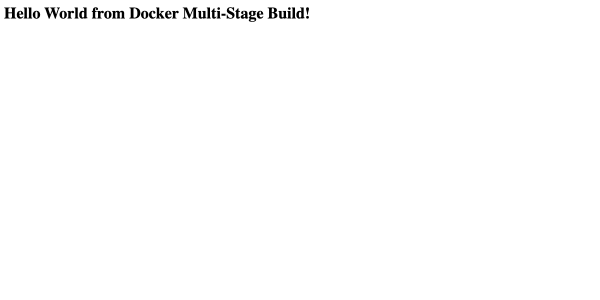
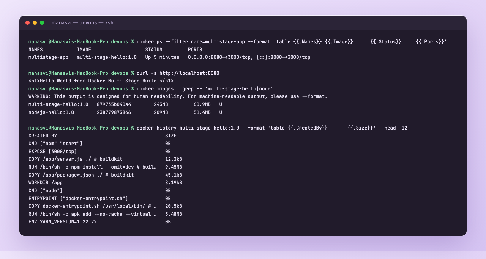
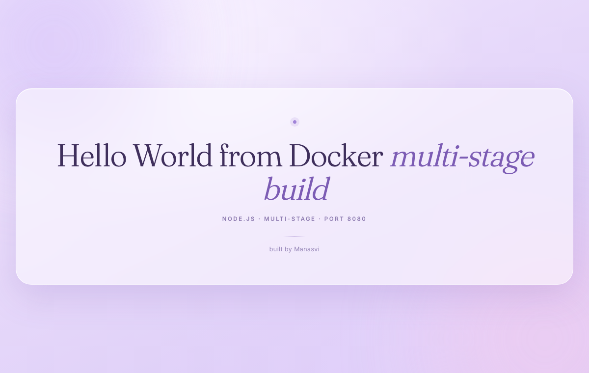
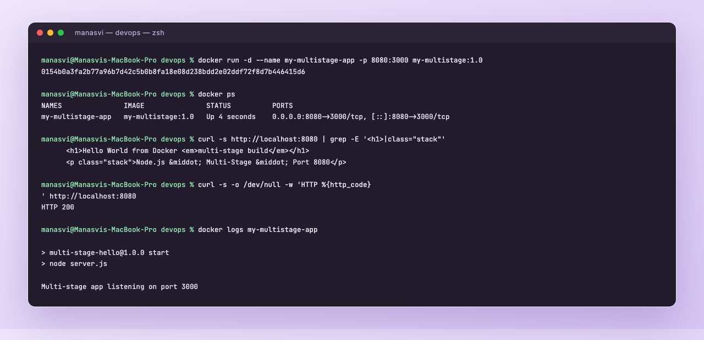
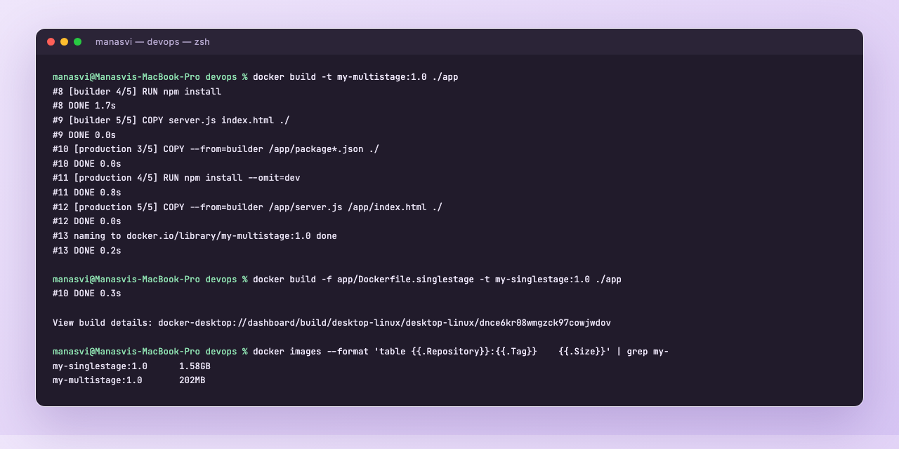

# Dockerfiles and Images: Multi-Stage Build

**Name:** Manasvi
**Enrollment number:** _<add your enrollment number here>_

Three tasks in this session: run the multi-stage Dockerfile from the course repo, document it with
screenshots, and deploy at least three different types of application with Docker.

- [Task 1: run the multi-stage Dockerfile](#task-1-run-the-multi-stage-dockerfile)
- [Task 2: documentation and evidence](#task-2-documentation-and-evidence)
- [Task 3: three application types deployed](#task-3-three-application-types-deployed)
- [How multi-stage builds actually work](#how-multi-stage-builds-actually-work)

---

## Task 1: run the multi-stage Dockerfile

### Clone the repo

```bash
git clone https://github.com/Nency-Ravaliya/devops-heros.git
cd devops-heros/session6-7-docker/multi-stage-dockerfile
ls
```

```
Dockerfile
package.json
server.js
```

The Dockerfile in the repo:

```dockerfile
FROM node:24-alpine AS builder
WORKDIR /app
COPY package*.json ./
RUN npm install
COPY . .

FROM node:24-alpine AS production
WORKDIR /app
COPY --from=builder /app/package*.json ./
RUN npm install --omit=dev
COPY --from=builder /app/server.js ./
EXPOSE 3000
CMD ["npm", "start"]
```

### Build, run and access it on port 8080

```bash
docker build -t multi-stage-hello:1.0 .
docker run -d --name multistage-app -p 8080:3000 multi-stage-hello:1.0
```

The app listens on 3000 inside the container, so I mapped host 8080 to container 3000.

```
$ docker ps --filter name=multistage-app --format "table {{.Names}}\t{{.Image}}\t{{.Status}}\t{{.Ports}}"
NAMES            IMAGE                   STATUS         PORTS
multistage-app   multi-stage-hello:1.0   Up 5 minutes   0.0.0.0:8080->3000/tcp, [::]:8080->3000/tcp

$ curl -s http://localhost:8080
<h1>Hello World from Docker Multi-Stage Build!</h1>
```

The required text is displayed, the container is running, and it is on port 8080.





---

## Task 2: documentation and evidence

I also wrote my own version of the same thing in [`app/`](app), so I could style the page and put a
single-stage Dockerfile next to the multi-stage one for comparison.

`app/Dockerfile`

```dockerfile
FROM node:20-alpine AS builder

WORKDIR /app

COPY package*.json ./
RUN npm install

COPY server.js index.html ./

FROM node:20-alpine AS production

WORKDIR /app

COPY --from=builder /app/package*.json ./
RUN npm install --omit=dev

COPY --from=builder /app/server.js /app/index.html ./

EXPOSE 3000
CMD ["npm", "start"]
```

```bash
docker build -t my-multistage:1.0 ./app
docker run -d --name my-multistage-app -p 8080:3000 my-multistage:1.0
```

### Application running successfully

```
$ curl -s http://localhost:8080 | grep -E '<h1>|class="stack"'
      <h1>Hello World from Docker <em>multi-stage build</em></h1>
      <p class="stack">Node.js &middot; Multi-Stage &middot; Port 8080</p>

$ curl -s -o /dev/null -w 'HTTP %{http_code}\n' http://localhost:8080
HTTP 200

$ docker logs my-multistage-app

> multi-stage-hello@1.0.0 start
> node server.js

Multi-stage app listening on port 3000
```



### docker ps showing the container on port 8080

```
$ docker ps --format "table {{.Names}}\t{{.Image}}\t{{.Status}}\t{{.Ports}}"
NAMES               IMAGE               STATUS          PORTS
my-multistage-app   my-multistage:1.0   Up 4 seconds    0.0.0.0:8080->3000/tcp, [::]:8080->3000/tcp
```



### Multi-stage against single-stage, same app

To see whether multi-stage is actually worth it I wrote
[`app/Dockerfile.singlestage`](app/Dockerfile.singlestage), which does everything in one full
`node:20` image, and built both:

```bash
docker build -t my-multistage:1.0 ./app
docker build -f app/Dockerfile.singlestage -t my-singlestage:1.0 ./app
```

```
$ docker images --format "table {{.Repository}}:{{.Tag}}\t{{.Size}}" | grep my-
my-singlestage:1.0      1.58GB
my-multistage:1.0       202MB
```

1.58 GB down to 202 MB for the same running application, about 87% smaller. Two things caused it:
the final stage starts from `node:20-alpine` instead of the full `node:20`, and it only installs
production dependencies while the dev ones stay behind in the builder stage.



Layer history of the final image, which shows only the production stage layers survive:

```
$ docker history multi-stage-hello:1.0 --format "table {{.CreatedBy}}\t{{.Size}}" | head -8
CREATED BY                                      SIZE
CMD ["npm" "start"]                             0B
EXPOSE [3000/tcp]                               0B
COPY /app/server.js ./ # buildkit               12.3kB
RUN /bin/sh -c npm install --omit=dev # buil…   9.45MB
COPY /app/package*.json ./ # buildkit           45.1kB
WORKDIR /app                                    8.19kB
```

---

## Task 3: three application types deployed

Three different stacks, three separate images, all running at once. Full code and Dockerfiles are in
[`../05-docker-hello-world`](../05-docker-hello-world).

| Type | Image | Base | Port mapping | Result |
|---|---|---|---|---|
| Node.js | `nodejs-hello:1.0` | `node:20-alpine` | 3001 -> 3000 | HTTP 200 |
| Python | `python-hello:1.0` | `python:3.12-slim` | 5001 -> 5000 | HTTP 200 |
| Java | `java-hello:1.0` | `eclipse-temurin:21-jdk` | 8085 -> 8080 | HTTP 200 |

```
$ docker ps --format "table {{.Names}}\t{{.Image}}\t{{.Status}}\t{{.Ports}}"
NAMES          IMAGE              STATUS         PORTS
java-hello     java-hello:1.0     Up 6 seconds   0.0.0.0:8085->8080/tcp, [::]:8085->8080/tcp
python-hello   python-hello:1.0   Up 6 seconds   0.0.0.0:5001->5000/tcp, [::]:5001->5000/tcp
node-hello     nodejs-hello:1.0   Up 6 seconds   0.0.0.0:3001->3000/tcp, [::]:3001->3000/tcp
```

Screenshots of all three pages, plus Apache, Nginx and React, are in
[`../05-docker-hello-world/screenshots`](../05-docker-hello-world/screenshots).

---

## How multi-stage builds actually work

A Dockerfile can have more than one `FROM`. Each `FROM` starts a new stage with a clean filesystem,
and I can name them with `AS <name>`. The final image is whatever the **last** stage produced.
Everything from the earlier stages is thrown away unless I explicitly copy it forward with
`COPY --from=<stage>`.

So the pattern is: stage one has the heavy build tooling (compilers, dev dependencies, test tools)
and produces an artifact. Stage two starts from a small runtime base and copies only that artifact
in.

### Why it matters

**Smaller images.** 1.58 GB against 202 MB in my own test above. Smaller images push and pull faster,
which matters on every CI run and every deploy.

**Smaller attack surface.** This is the DevSecOps angle. If the compiler, git, curl and the whole
dev dependency tree are not in the image, they cannot be exploited in production and they cannot
show up in a Trivy scan. Fewer packages means fewer CVEs.

**No secrets left in the final image.** Anything used only at build time, like a private registry
token, stays in the builder stage and is not part of the shipped layers.

**Everything still in one file.** Before multi-stage, teams used a build script plus two Dockerfiles
to get the same result.

### Things worth remembering

```dockerfile
FROM node:20-alpine AS builder      # name a stage
COPY --from=builder /app/dist ./    # copy from a named stage
COPY --from=nginx:alpine /etc/nginx/nginx.conf ./   # you can even copy from an image
```

```bash
docker build --target builder -t debug:1.0 .   # stop at a stage, useful for debugging
```

Real cases where I would reach for it: React or Angular (node builds, nginx serves), Java (Maven
builds the jar, JRE runs it), Go (compile in the golang image, run the binary on scratch or alpine),
and anything where the build tools are much bigger than the runtime.
