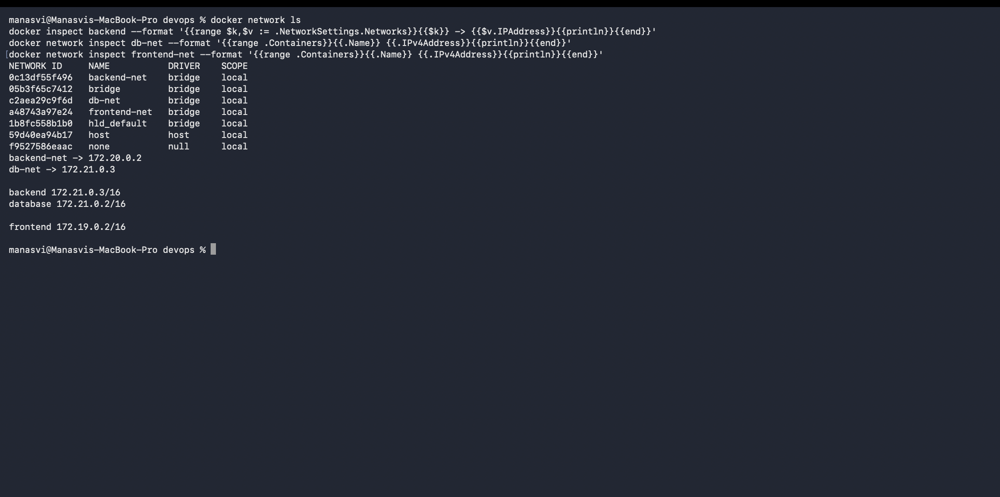
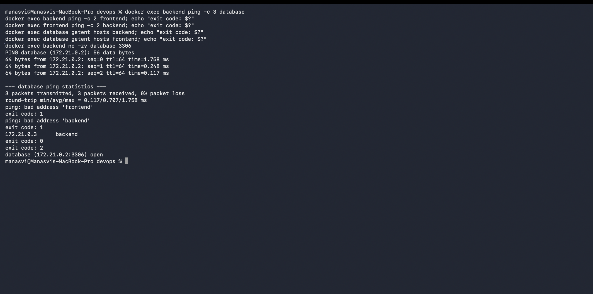
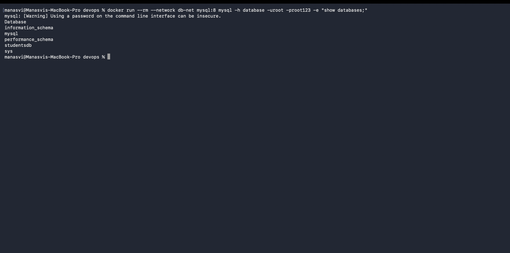
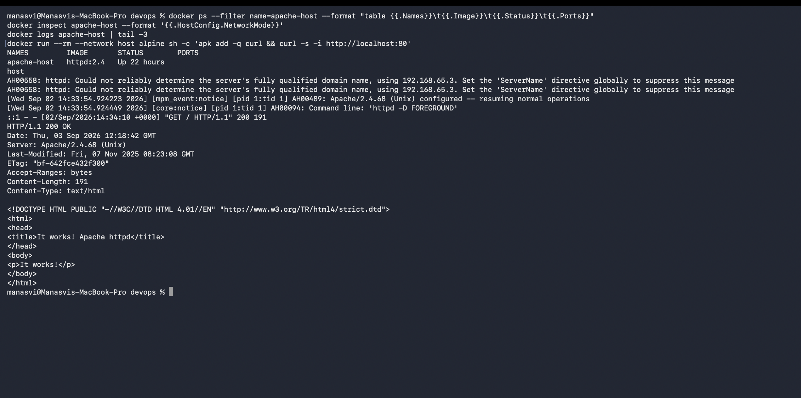
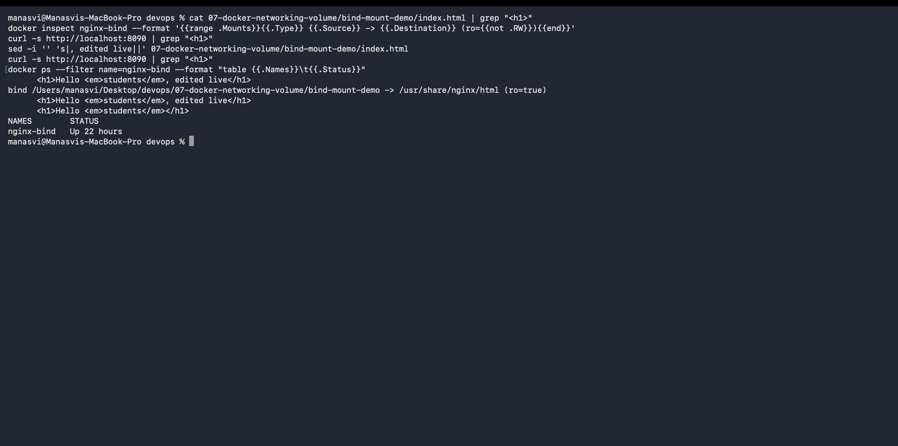

# Docker Networking and Volumes

Four tasks: container networking with three networks, the host network driver, a bind mount, and
research on overlay networks.

- [Task 1: container networking](#task-1-container-networking)
- [Task 2: host network](#task-2-host-network)
- [Task 3: bind mount](#task-3-bind-mount)
- [Task 4: overlay networks](#task-4-overlay-networks)

---

## Task 1: Container networking

Plan: three containers (frontend, backend, database), three user defined networks, and the backend
attached to two of them so it can talk to both sides while frontend and database stay isolated from
each other.

```
frontend-net          backend-net          db-net
   |                     |                   |
frontend              backend  ------------  backend
                                             database
```

### Creating the networks

```bash
docker network create frontend-net
docker network create backend-net
docker network create db-net
```

```
$ docker network ls
NETWORK ID     NAME           DRIVER    SCOPE
0c13df55f496   backend-net    bridge    local
05b3f65c7412   bridge         bridge    local
c2aea29c9f6d   db-net         bridge    local
a48743a97e24   frontend-net   bridge    local
1b8fc558b1b0   hld_default    bridge    local
59d40ea94b17   host           host      local
f9527586eaac   none           null      local
```

The three I made are `bridge` driver. `bridge`, `host` and `none` are the defaults docker ships
with, and `hld_default` is left over from a docker compose project of mine, which is worth knowing:
compose auto creates a network named after the project directory.

### Starting the containers

```bash
docker run -d --name frontend --network frontend-net nginx:alpine
docker run -d --name backend  --network backend-net  alpine sleep infinity
docker run -d --name database --network db-net \
  -e MYSQL_ROOT_PASSWORD=root123 -e MYSQL_DATABASE=studentsdb mysql:8
```

`alpine` for the backend because it is tiny and I only need a shell to test from, with
`sleep infinity` to keep it alive since alpine would otherwise exit immediately.

### Adding the backend to a second network

```bash
docker network connect db-net backend
```

```
$ docker inspect backend --format '{{range $k,$v := .NetworkSettings.Networks}}{{$k}} -> {{$v.IPAddress}}{{println}}{{end}}'
backend-net -> 172.20.0.2
db-net -> 172.21.0.3
```

The backend now has two interfaces with an address on each network. That is the whole point: one
container can sit in two networks and act as the bridge between them.

```
$ docker network inspect backend-net  --format '{{range .Containers}}{{.Name}} {{.IPv4Address}}{{println}}{{end}}'
backend 172.20.0.2/16

$ docker network inspect db-net       --format '{{range .Containers}}{{.Name}} {{.IPv4Address}}{{println}}{{end}}'
backend 172.21.0.3/16
database 172.21.0.2/16

$ docker network inspect frontend-net --format '{{range .Containers}}{{.Name}} {{.IPv4Address}}{{println}}{{end}}'
frontend 172.19.0.2/16
```



### Connectivity checks

Backend to database, both on `db-net`:

```
$ docker exec backend ping -c 3 database
PING database (172.21.0.2): 56 data bytes
64 bytes from 172.21.0.2: seq=0 ttl=64 time=1.758 ms
64 bytes from 172.21.0.2: seq=1 ttl=64 time=0.248 ms
64 bytes from 172.21.0.2: seq=2 ttl=64 time=0.117 ms

--- database ping statistics ---
3 packets transmitted, 3 packets received, 0% packet loss
round-trip min/avg/max = 0.117/0.707/1.758 ms
```

Works, and by container name rather than IP. That name came from docker's embedded DNS server, which
every container on a user defined network reaches at `127.0.0.11`. Sub millisecond round trips,
because this never leaves the host.

Backend to frontend, different networks:

```
$ docker exec backend ping -c 2 frontend
ping: bad address 'frontend'
exit code: 1
```

And the other direction:

```
$ docker exec frontend ping -c 2 backend
ping: bad address 'backend'
exit code: 1
```

Both fail, which is the correct result. The error is `bad address`, not "unreachable", because the
name does not even resolve. Docker only publishes a container's name in the DNS of the networks it
is attached to, so isolation happens at name resolution before it gets anywhere near IP routing.

The database container has no `ping` binary, so I checked resolution there with `getent`:

```
$ docker exec database getent hosts backend
172.21.0.3      backend
exit code: 0

$ docker exec database getent hosts frontend
exit code: 2
```

Database sees backend (shared `db-net`) and not frontend (nothing in common). Exactly as designed.

Finally, a real connection rather than just ICMP:

```
$ docker exec backend nc -zv database 3306
database (172.21.0.2:3306) open

$ docker run --rm --network db-net mysql:8 mysql -h database -uroot -proot123 -e 'show databases;'
Database
information_schema
mysql
performance_schema
studentsdb
sys
```

Port 3306 is open from the backend, and a MySQL client on `db-net` can query the database by name,
including the `studentsdb` I created with the env variable.

In the screenshot you can also see two failed attempts before that. Alpine's `mysql` package is
actually the MariaDB client, and it could not authenticate against MySQL 8, first tripping on the
self-signed certificate and then on the `caching_sha2_password` plugin. That is a client problem, not
a network one, which is why the `nc -zv` check and the real `mysql:8` client both succeed. Worth
keeping in the write-up because "connection failed" does not always mean the network is at fault.





### Summary of what is reachable

| From | To | Same network? | Result |
|---|---|---|---|
| backend | database | yes, `db-net` | ping works, port 3306 open |
| database | backend | yes, `db-net` | name resolves |
| backend | frontend | no | fails, name does not resolve |
| frontend | backend | no | fails, name does not resolve |
| frontend | database | no | fails |

### Why user defined networks over the default bridge

On the default `bridge` network, containers can reach each other by IP but **not** by name, and
every container on the host shares it. On a user defined network you get automatic DNS between
containers and proper isolation from everything else. So in practice: always create a network.

---

## Task 2: Host network

With `--network host` the container does not get its own network namespace, it uses the host's
directly. No NAT, no port mapping, and a port the container opens is a port on the host.

```bash
docker pull httpd:2.4
docker run -d --name apache-host --network host httpd:2.4
```

```
$ docker ps --filter name=apache-host --format "table {{.Names}}\t{{.Image}}\t{{.Status}}\t{{.Ports}}"
NAMES         IMAGE       STATUS        PORTS
apache-host   httpd:2.4   Up 22 hours

$ docker inspect apache-host --format '{{.HostConfig.NetworkMode}}'
host
```

The `PORTS` column is empty on purpose. There is nothing to publish because the container is already
on the host's network, and `-p` is ignored in host mode.

Apache started fine:

```
$ docker logs apache-host | tail -3
[Wed Sep 02 14:33:54.924223 2026] [mpm_event:notice] [pid 1:tid 1] AH00489: Apache/2.4.68 (Unix) configured -- resuming normal operations
[Wed Sep 02 14:33:54.924449 2026] [core:notice] [pid 1:tid 1] AH00094: Command line: 'httpd -D FOREGROUND'
::1 - - [02/Sep/2026:14:34:10 +0000] "GET / HTTP/1.1" 200 191
```

That last line is Apache's own access log recording the request I made from inside the host
namespace, answered `200` with 191 bytes.

### One honest caveat about macOS

I am on Docker Desktop for Mac, where containers run inside a Linux VM. So `--network host` means
the host **VM's** network, not macOS itself, and `curl http://localhost:80` from my Mac terminal
returned nothing:

```
$ curl -s -i http://localhost:80

```

To confirm Apache really is serving on port 80 of that host network, I checked from inside the same
namespace:

```
$ docker run --rm --network host alpine sh -c 'apk add -q curl && curl -s -i http://localhost:80'
HTTP/1.1 200 OK
Date: Thu, 03 Sep 2026 12:18:42 GMT
Server: Apache/2.4.68 (Unix)
Last-Modified: Fri, 07 Nov 2025 08:23:08 GMT
ETag: "bf-642fce432f300"
Accept-Ranges: bytes
Content-Length: 191
Content-Type: text/html

<!DOCTYPE HTML PUBLIC "-//W3C//DTD HTML 4.01//EN" "http://www.w3.org/TR/html4/strict.dtd">
<html>
<head>
<title>It works! Apache httpd</title>
</head>
<body>
<p>It works!</p>
</body>
</html>
```

`HTTP/1.1 200 OK` and Apache's default "It works!" page, fetched over `localhost:80` with no `-p`
mapping anywhere, which is the whole point of the host driver. On a native Linux host, or with
Docker Desktop's host networking option enabled, `curl http://localhost:80` from the terminal would
return the same page directly.



### bridge vs host vs none

| | bridge (default) | host | none |
|---|---|---|---|
| Own network namespace | yes | no, shares the host's | yes, but empty |
| Needs `-p` to be reachable | yes | no | n/a |
| Container to container by name | yes on user defined networks | no, it is just the host | no |
| Performance | slight NAT overhead | native, no NAT | n/a |
| Port conflicts | no, each container has its own space | yes, shares host ports | no |
| Good for | almost everything | high throughput, or a container that must see all host interfaces | fully isolated jobs |

---

## Task 3: Bind mount

A bind mount maps a directory from the host straight into the container. The container reads the
host's actual files, so an edit on the host is visible immediately with no rebuild and no restart.

### Setup

Folder [`bind-mount-demo/`](bind-mount-demo) with an `index.html` that says **Hello students**, then
mounted into nginx's web root:

```bash
docker run -d --name nginx-bind -p 8090:80 \
  -v $(pwd)/07-docker-networking-volume/bind-mount-demo:/usr/share/nginx/html:ro \
  nginx:alpine
```

```
$ docker inspect nginx-bind --format '{{range .Mounts}}{{.Type}} {{.Source}} -> {{.Destination}} (ro={{not .RW}}){{end}}'
bind /Users/manasvi/Desktop/devops/07-docker-networking-volume/bind-mount-demo -> /usr/share/nginx/html (ro=true)
```

Type is `bind`, and I mounted it `:ro` so the container cannot write back into my project folder.
The source path has to be absolute, which is why `$(pwd)` is in there.

```
$ curl -s http://localhost:8090
...
      <h1>Hello <em>students</em></h1>
```


### Editing the file without touching the container

I changed the heading on my Mac and did **not** restart anything. The page updated on the next
reload:


Then I did the same thing in reverse from the terminal, to have the whole loop in one place. The
file said "Hello students, edited live" at this point, and I used `sed` to strip that suffix back
off:

```
$ cat 07-docker-networking-volume/bind-mount-demo/index.html | grep "<h1>"
      <h1>Hello <em>students</em>, edited live</h1>

$ docker inspect nginx-bind --format '{{range .Mounts}}{{.Type}} {{.Source}} -> {{.Destination}} (ro={{not .RW}}){{end}}'
bind /Users/manasvi/Desktop/devops/07-docker-networking-volume/bind-mount-demo -> /usr/share/nginx/html (ro=true)

$ curl -s http://localhost:8090 | grep "<h1>"
      <h1>Hello <em>students</em>, edited live</h1>

$ sed -i '' 's|, edited live||' 07-docker-networking-volume/bind-mount-demo/index.html

$ curl -s http://localhost:8090 | grep "<h1>"
      <h1>Hello <em>students</em></h1>

$ docker ps --filter name=nginx-bind --format "table {{.Names}}\t{{.Status}}"
NAMES        STATUS
nginx-bind   Up 22 hours
```

Read the two `curl` results either side of the `sed`: different content, no rebuild, no
`docker restart`, no `docker cp`. And `Up 22 hours` is the proof, since the uptime never resets. If
this had been a `COPY` in a Dockerfile instead of a bind mount, that same change would have meant
rebuilding the image and recreating the container.

The `:ro` flag is worth noting here too. Nginx only ever reads these files, so read only costs
nothing and means a compromised container cannot write into my project folder.



### Bind mount vs volume

| | Bind mount | Named volume |
|---|---|---|
| Where the data lives | a path I choose on the host | docker managed, under `/var/lib/docker/volumes` |
| Syntax | `-v /abs/host/path:/container/path` | `-v myvol:/container/path` |
| Host path must exist | yes | no, docker creates it |
| Portable across machines | no, path is machine specific | yes |
| Good for | local development, live editing source or config | databases and production data |

Rule of thumb I came away with: bind mounts for development, named volumes for anything whose data
has to survive properly. Both keep data alive after the container is removed, which is the real
point since a container's own writable layer disappears with it.

---

## Task 4: Overlay networks

### What they are

The `bridge` driver only works on one host. An **overlay** network spans multiple Docker hosts, so
containers on different physical or virtual machines get one flat virtual network and can talk to
each other by name as though they were side by side.

### How it works

It uses VXLAN. Container traffic gets encapsulated in UDP packets (port 4789), sent across the
physical network to the right host, then unwrapped and delivered to the target container. Each
container sees a normal IP on a normal subnet and knows nothing about the tunnelling.

The cluster needs a key value store to keep the network state and the service to IP mappings in
sync. With Docker Swarm that store is built in, and for a plain docker setup you would run something
like Consul or etcd.

Ports that must be open between the hosts:

```
2377/tcp   swarm cluster management
7946/tcp   node to node communication
7946/udp   node to node communication
4789/udp   overlay data path, VXLAN
```

### Creating one

```bash
docker swarm init                                  # on the manager node
docker swarm join --token <token> <manager-ip>     # on each worker node

docker network create -d overlay my-overlay
docker network create -d overlay --attachable my-overlay   # so plain containers can join too

docker service create --name web --network my-overlay --replicas 3 nginx:alpine
```

`--attachable` matters: without it only swarm services can use the network, not containers started
with `docker run`.

I could not demonstrate this with real output because it needs at least two Docker hosts and I only
have the single Docker Desktop node here, so this task was research as the homework asked.

### Use cases

- A swarm or multi node cluster where the containers of one application are spread over several
  machines and still need to reach each other by service name.
- Scaling out beyond what one host can hold, without rewriting the app to use host IPs and ports.
- Keeping east west traffic on its own encrypted network. `docker network create -d overlay --opt
  encrypted` turns on IPsec between the nodes.
- Multi tier applications where the frontend service and the database service happen to be scheduled
  onto different hosts.

### bridge against overlay

| | bridge | overlay |
|---|---|---|
| Scope | one host | multiple hosts |
| Needs a cluster | no | yes, swarm or an external key value store |
| Transport | local Linux bridge | VXLAN tunnels over UDP 4789 |
| Service discovery | DNS within the host | DNS across the whole cluster |
| Encryption | no | optional with `--opt encrypted` |
| Typical use | local dev, single host apps | swarm services, multi host production |

Worth adding for context: Kubernetes solves the same problem but does not use docker overlay
networks. It uses a CNI plugin such as Calico, Flannel or Cilium, and several of those also use
VXLAN underneath, so the concept carries over.

---

## Cleanup

```bash
docker rm -f frontend backend database apache-host nginx-bind
docker network rm frontend-net backend-net db-net
docker system prune -f
```
